<div align="center">

# 📚 YKS Takip

**Çevrimdışı-öncelikli YKS hazırlık uygulaması — deneme analizi, haftalık plan, odak sayacı, konu takibi ve isteğe bağlı BYOK yapay zekâ koçu. Android tabletler için.**

*Offline-first YKS (Turkish university entrance exam) prep tracker — mock-exam analytics, weekly planner, focus timer, topic tracking, and an optional bring-your-own-key AI coach. Built for Android tablets.*


**[🇹🇷 Türkçe](#turkce) · [🇬🇧 English](#english)**

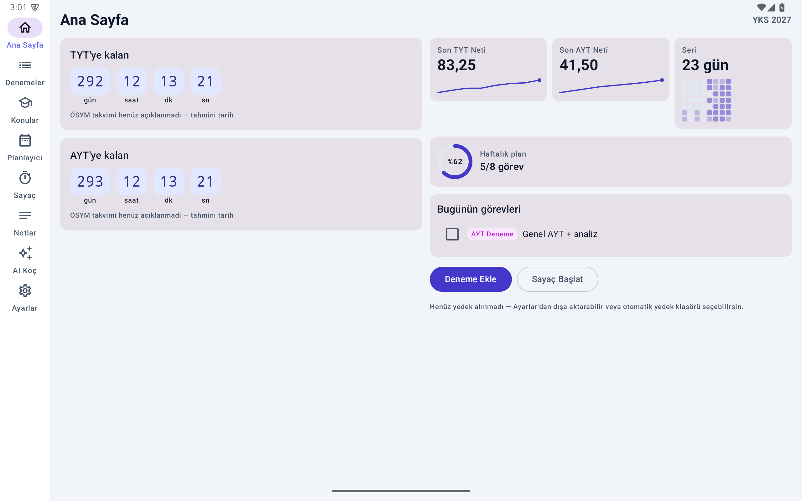 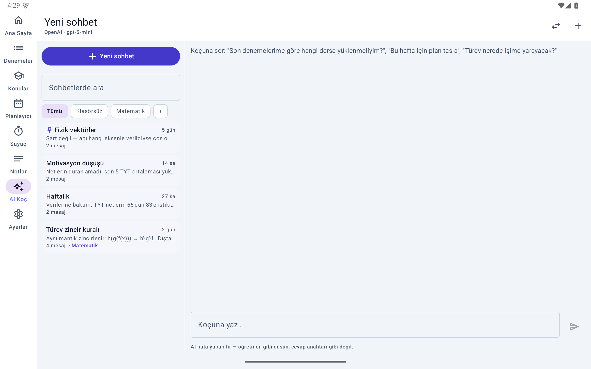

</div>

---

<a id="turkce"></a>

# 🇹🇷 Türkçe

## İçindekiler

- [Bu proje nedir?](#tr-nedir)
- [Tasarım ilkeleri](#tr-ilkeler)
- [Özellikler](#tr-ozellikler)
- [Ekran görüntüleri](#tr-ekranlar)
- [Gizlilik modeli](#tr-gizlilik)
- [Kurulum (kullanıcılar)](#tr-kurulum)
- [Derleme (geliştiriciler)](#tr-derleme)
- [AI Koç'u yapılandırma](#tr-ai)
- [Veri modeli ve yedekleme](#tr-veri)
- [CSV formatı](#tr-csv)
- [Test ve doğrulama disiplini](#tr-test)
- [Belgeler](#tr-belgeler)
- [Bilinçli kapsam dışı](#tr-kapsam)
- [Katkı](#tr-katki)
- [Lisans ve teşekkürler](#tr-lisans)

<a id="tr-nedir"></a>
## Bu proje nedir?

YKS Takip, **YKS 2027'ye (Sayısal) hazırlanan kardeşim için** yazdığım, Samsung Galaxy
Tab S9 FE+ üzerinde yandan yüklemeyle (sideload) çalışan bir hazırlık takip
uygulamasıdır. Play Store'da yoktur ve olması hedeflenmemiştir; bu depo, aynı şeyi kendi
kardeşi/öğrencisi için isteyen herkes derleyebilsin diye açıktır.

Uygulama beş soruya cevap verir:

1. **Denemelerim nasıl gidiyor?** — TYT/AYT tam denemeleri ve branş denemeleri; ders
   bazında ham doğru/yanlış girişi, net trendleri, doğruluk yüzdeleri, zayıf konu
   sıralaması.
2. **Bu hafta ne çalışacağım?** — Hafta anahtarlı 7 günlük pano; geçen haftayı
   kopyalama; görev bitince *gerçekten* çözülen soru sayısının yakalanması.
3. **Ne kadar çalıştım?** — Geri sayım + kronometre; her oturum kayda geçer; haftalık
   ders bazında çalışma süresi, seri (streak) ve 8 haftalık aktivite ısı şeridi.
4. **Hangi konu eksik?** — ~140 konuluk gömülü müfredat kataloğu; deneme başına konu
   işaretleri (yanlış/boş + hata türü: Bilgi/İşlem/Dikkat/Süre); Zayıf Konular analizi.
5. **Sınava ne kadar var?** — TYT + AYT çift geri sayım (ÖSYM takvimi açıklanana kadar
   "tahmini" uyarısıyla) ve ana ekran widget'ı.

Bunlara ek olarak isteğe bağlı bir **AI Koç** vardır: kendi API anahtarınızı girersiniz
(BYOK), koç yerel istatistikleri (son netler, plan tamamlama, zayıf konular, çalışma
süreleri) bağlam olarak alır ve kişisel tavsiye verir. Anahtar girilmediği sürece sekme
görünmez ve uygulama **hiç ağ trafiği üretmez**.

<a id="tr-ilkeler"></a>
## Tasarım ilkeleri

Bu ilkeler koddan önce yazıldı ve her sürümde korunuyor
([PRD](docs/PRD-v2.md)'nin çekirdeği):

- **Çevrimdışı-öncelikli.** Hesap yok, kayıt yok, bulut yok. `INTERNET` izni yalnızca
  *sizin yapılandırdığınız* AI uç noktası içindir.
- **Telemetri yok.** Analitik, çökme raporu, reklam SDK'sı — hiçbiri yok.
- **Dürüst sayılar.** Net asla 0'a kırpılmaz (2 doğru / 20 yanlış = **−3,00**);
  "çözülen soru" hedeften değil, öğrencinin bitirirken girdiği gerçek sayıdan gelir;
  puan/sıralama tahmini bilinçli olarak yoktur (yıllık katsayılarla çevrimdışı puan
  hesabı yanıltıcıdır — dürüst metrik nettir).
- **Şeffaf paylaşım.** Aile ile paylaşım öğrencinin elindedir: haftalık rapor *metnini*
  kendisi paylaşır (yalnız özet; sohbetler ve notlar asla) veya otomatik yedek klasörünü
  Drive ile eşitlenen ortak bir klasöre yönlendirir. Gizli izleme kanalı yoktur ve
  yapılmayacaktır.
- **Veri kaybına tahammül yok.** Şema değişiklikleri yalnızca ekleyerek yapılır; her
  migration hem üretilen şemayla bit-bit hem de emülatörde gerçek veriyle *yerinde
  yükseltme* olarak doğrulanır. Yedek formatı her zaman tüm eski sürümleri okur.
- **Her içe aktarma insan onayından geçer.** CSV veya AI kaynaklı hiçbir veri
  önizleme/onay ekranı görmeden veritabanına yazılmaz.

<a id="tr-ozellikler"></a>
## Özellikler

### 📊 Deneme takibi ve analiz
- **Dört deneme türü:** TYT (120 soru), AYT Sayısal (80 soru), TYT branş, AYT branş
  (yayınevine göre değişken soru sayısı).
- Ders başına **ham doğru/yanlış girişi**; boş ve net türetilir. Canlı önizleme, ders
  sınırında `D+Y ≤ soru` doğrulaması, odak otomatik ilerletme — 8 sayı 60 saniyede
  girilir.
- **Net matematiği tam sayıdır:** çeyrek birimlerle saklanır (`4·D − Y`), kayan nokta
  hatası olamaz; negatif netler uçtan uca akar.
- Aynı gün + tür için **kopya uyarısı**; düzenleme ve **geri alınabilir silme**.
- **Analiz** (Vico grafikleri): TYT/AYT toplam net trendi (indeks eksenli — denemeler
  kümelendiğinde tarih ekseni boşluk yaratır), ders bazında net trendi, doğruluk %,
  boş-yanlış kolonları, Son-5 ortalaması dahil KPI'lar ve KPI **sparkline**'ları.
- **Zayıf Konular:** deneme girişindeki konu işaretlerinden sıralanır; şerit çubuğun
  uzunluğu yanlış sayısı, dilimleri hata türü dağılımıdır (Bilgi/İşlem/Dikkat/Süre).

### 🗓 Haftalık planlayıcı
- Pazartesi'ye (Europe/Istanbul) anahtarlanmış 7 günlük pano; hafta değişince **arşiv
  kendiliğinden oluşur** — yıkıcı "sıfırla" yoktur.
- Yeni haftanın ilk açılışında tek dokunuşla **"Geçen haftanın planını kopyala"**
  (görevler işaretsiz kopyalanır).
- 10 sabit kategori (renkleri tema jetonudur, açık/koyu varyantlıdır).
- Görev bitince **çözülen soru sayısı** sorulur (hedefle önceden doldurulmuş tuş
  takımı — tek dokunuş yeter). Haftalık toplamlar bu gerçek sayıdan hesaplanır.
- **Geçmiş Haftalar:** salt-okunur hafta listesi (tamamlanma %, hedef/çözülen, çalışma
  dk), çift eksenli 8 haftalık trend (çalışma dk kolonları + biten görev çizgisi) ve
  hafta başına **"Haftalık Raporu Paylaş"**.

### ⏱ Sayaç ve kronometre
- Geri sayım (1–300 dk) **ve** v1.2'den beri ileri sayan kronometre; ilerleme halkalı
  kadran.
- Güvenilirlik bir durum makinesidir: durum DataStore'a yalnızca geçişlerde yazılır;
  çalışırken bildirimde canlı kronometre gösteren bir ön plan servisi; bitişin
  garantisi `USE_EXACT_ALARM` ile kurulan kesin alarmdır (uygulama öldürülse, cihaz
  Doze'a girse bile çalar); yeniden başlatmada `BOOT_COMPLETED` alıcısı alarmı yeniden
  kurar veya "süre cihaz kapalıyken doldu" diye kapatır.
- ≥60 sn süren her oturum `focus_sessions` tablosuna yazılır (kategori ve görev bağı
  isteğe bağlı); molalar önerilir ama istatistiklere **yazılmaz**.

### 📚 Konu takibi
- ~140 konuluk gömülü katalog (2027 için mevcut müfredat geçerli; Maarif modeli 2028'de
  başlıyor — katalog buna göre seçildi).
- Konu başına üç durum: çalıştım / soru çözdüm / tekrar ettim; ders başına ilerleme
  halkaları; deneme işaretlerinden gelen yanlış rozetleri.

### 🤖 AI Koç (isteğe bağlı, BYOK)
- **Profiller:** her profil ad + protokol + taban URL + model + kendi şifreli anahtarını
  taşır. Şablonlar: Claude, OpenAI, Gemini, xAI Grok, OpenRouter, OpenCode Zen,
  Ollama (LAN), Özel. Aktif profil sohbet başlığından tek dokunuşla değiştirilir.
- **Claude resmî Anthropic Java SDK ile** konuşur (OpenAI-uyumluluk katmanı değil);
  diğer her şey tek bir OpenAI-uyumlu istemciden geçer. **Ollama** seçeneği trafiği
  tamamen yerel ağda tutar (küçük yerel modellerin Türkçe matematik/fen koçluğunda
  belirgin zayıf olduğu notuyla).
- **Bağlantıyı Sına** gerçek `models` ucuna gider ve hatayı üç katmanda gösterir: dostça
  Türkçe açıklama + HTTP kodu + sunucunun kendi hata gövdesi. **Modelleri Getir** canlı
  model listesini çekip arama/seçim sunar.
- Yanıtlar **akışlıdır** (streaming) ve durdurulabilir. Koç, izne bağlı olarak yerel
  istatistik özetini bağlam alır (`Ayarlar → istatistik paylaşımı` ile kapatılır).
- Yanıtlar **"Nota kaydet"** ile Notlar'a düşer. LLM'ler zor matematikte hata yapabilir
  — bu bir öğretmen yardımcısıdır, cevap anahtarı değil.
- **Oturumlar (v1.3):** geniş ekranda kalıcı sol panel, dar ekranda alt sayfa. Tüm
  sohbetler; sabitliler önce, sonra son mesaj etkinliğine göre. Uzun basış: yeniden
  adlandır (elle verilen ad otomatik başlıkla asla ezilmez) / sabitle / klasöre taşı /
  sil + **Geri Al**. **Klasörler** sohbetleri asla silmez (klasör silinirse sohbetler
  "Klasörsüz"e düşer). **Arama** başlık + mesaj içeriğinde, klasörler arası çalışır ve
  sonuçlar klasör rozeti taşır.

### 📥 İçe/dışa aktarma
- **JSON yedek** (SAF ile dosya seçimi): tam durum; içe aktarma önce otomatik güvenlik
  anlık görüntüsü alır. **Haftalık otomatik yedek** seçilen klasöre yazar, son 8 dosyayı
  tutar; panoda hatırlatma çıkar.
- **CSV dışa aktarma + paylaşma** ve **CSV içe aktarma**: önizleme tablosu, aynı
  gün+tür için mükerrer işaretleme, yalnızca seçilenler *eklenir* (asla silmez).
- **AI ile karne okuma:** karne fotoğrafı / PDF / yapıştırılan metin Claude'a gider
  (yalnız Anthropic profilleri; görsel ≤1568px'e küçültülür, PDF ≤20MB), sonuç **onay
  için önceden doldurulmuş deneme formunda** açılır — hiçbir şey otomatik kaydedilmez.

### 📝 Notlar
- Markdown notlar (canlı önizleme); AI Koç yanıtlarından tek dokunuşla not oluşturma.

### 🎨 Arayüz
- Açık / Koyu / Sistem tema; tüm kategori ve grafik renkleri iki temalı jetonlardır.
- `material3-adaptive` ile uyarlanabilir yerleşim: tablette yatay = kalıcı raylar ve
  yan paneller, dikey/dar = alt çubuk ve alt sayfalar. Dokunma hedefleri ≥48dp.
- Grafiklerin yanında sayılar her zaman yazılıdır; her ekranın boş durumu vardır.
- Glance ana ekran **geri sayım widget'ı**.

<a id="tr-ekranlar"></a>
## Ekran görüntüleri

| | |
|:---:|:---:|
|  | 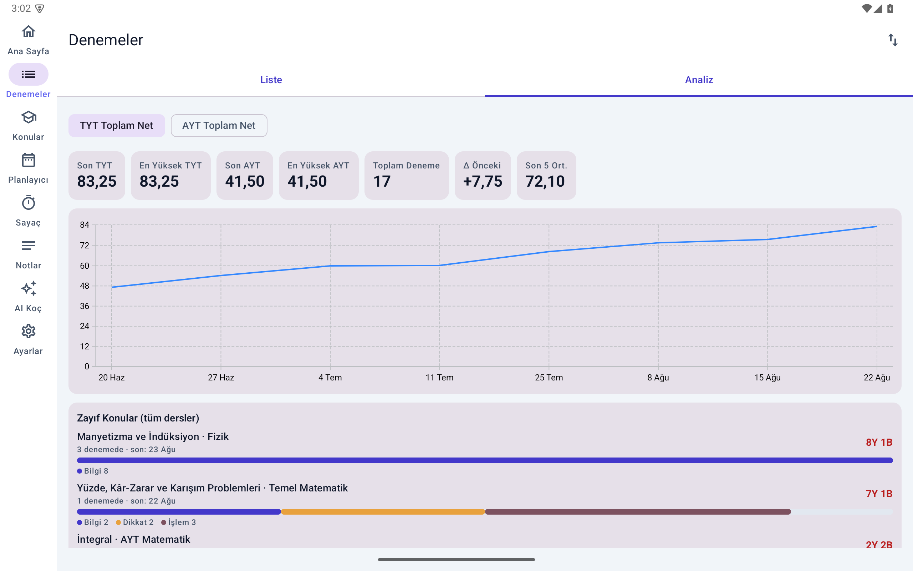 |
| **Ana Sayfa** — çift geri sayım, bugünün görevleri, KPI sparkline'ları, seri + ısı şeridi | **Analiz** — TYT/AYT net trendi, ders bazında grafikler |
| 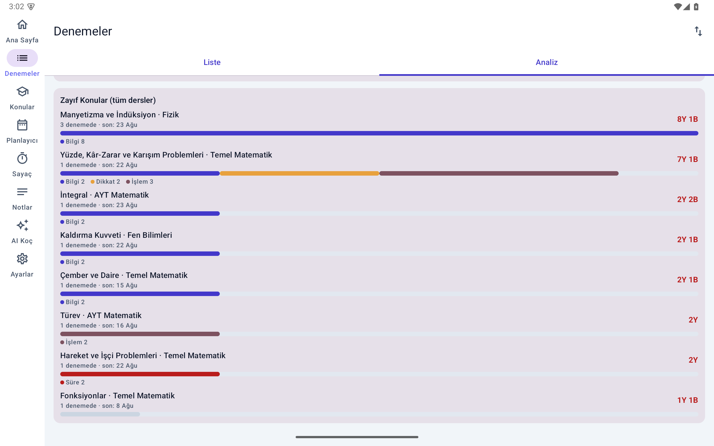 | 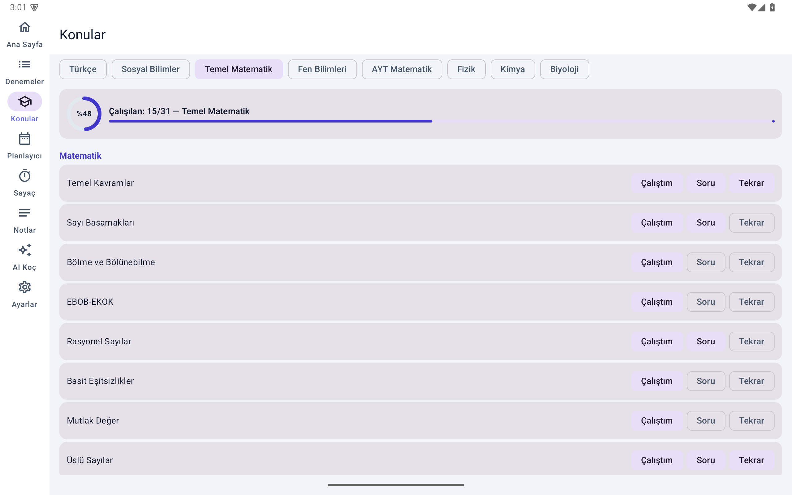 |
| **Zayıf Konular** — hata türü dilimli şerit çubuklar | **Konular** — ilerleme halkaları, çalışma çizelgesi |
| 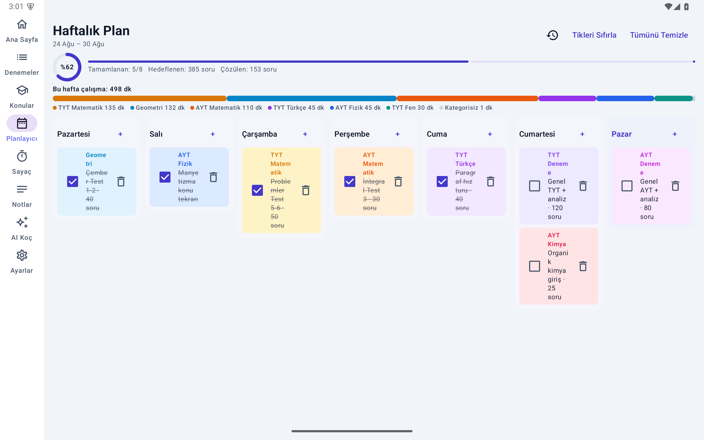 | 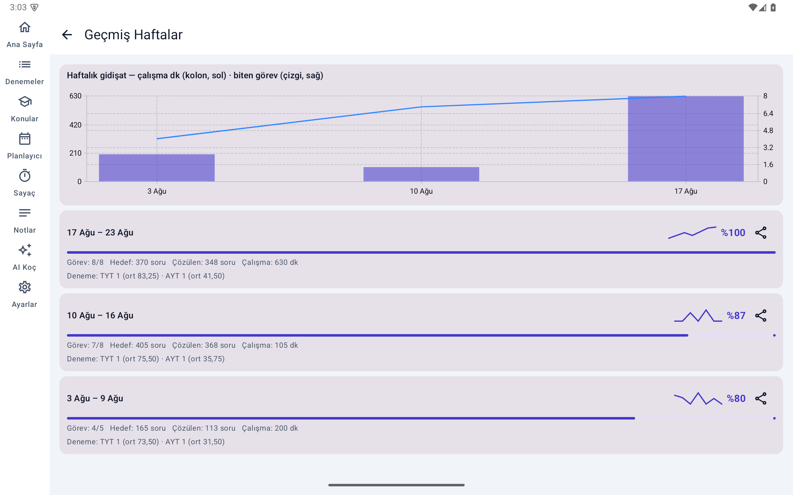 |
| **Planlayıcı** — 7 günlük pano, kategori süre şeridi | **Geçmiş Haftalar** — çift eksenli trend, rapor paylaşımı |
| 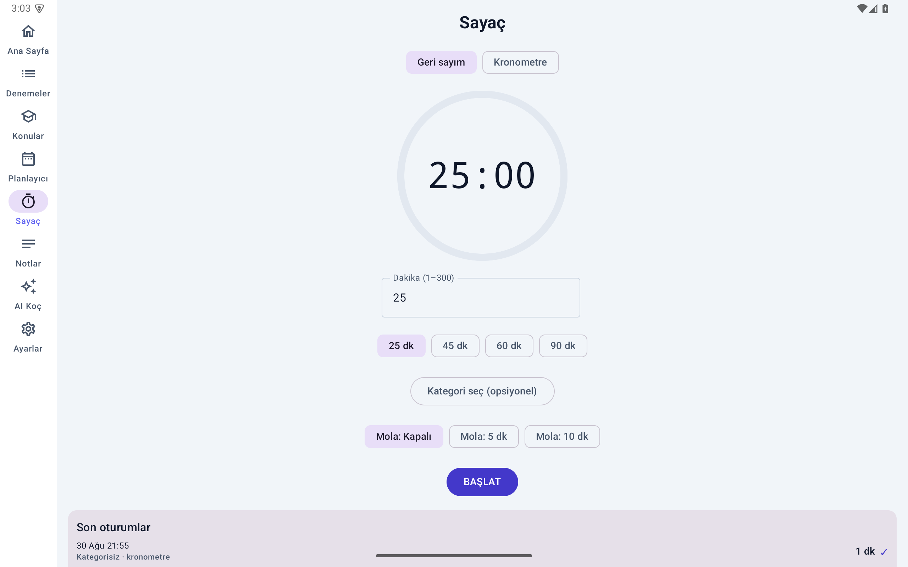 | 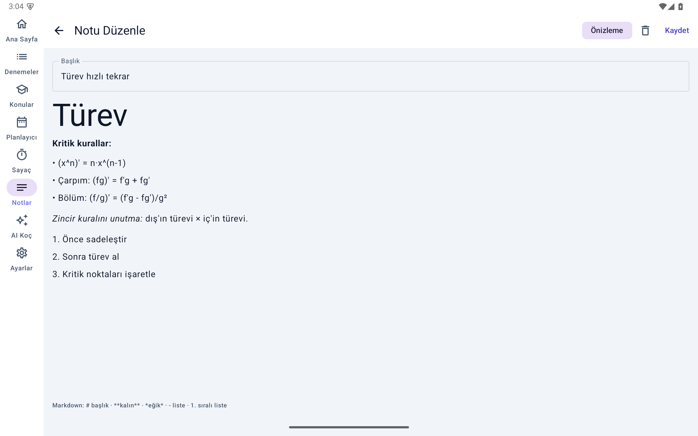 |
| **Sayaç** — ilerleme halkalı kadran, kronometre modu | **Notlar** — markdown önizleme |
|  | 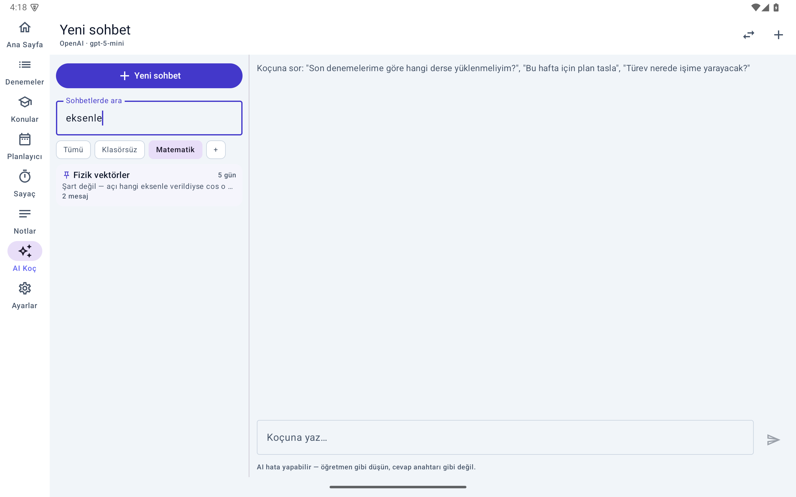 |
| **AI Koç** — oturum paneli, klasör çipleri, sabitleme | **Arama** — başlık + içerikte, klasör rozetli sonuçlar |
| 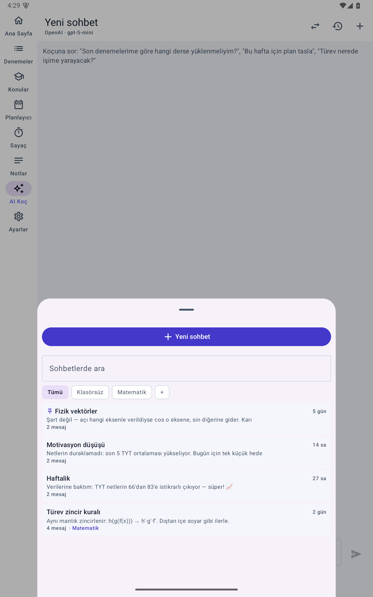 | 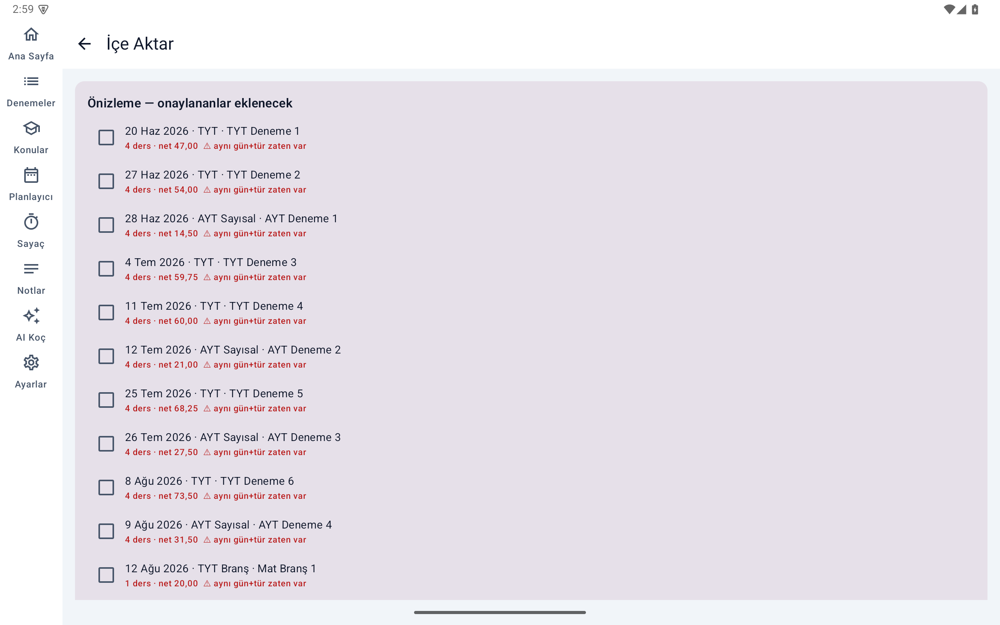 |
| **Dar ekran** — oturum listesi alt sayfada | **CSV içe aktarma** — önizleme + mükerrer uyarısı |
| 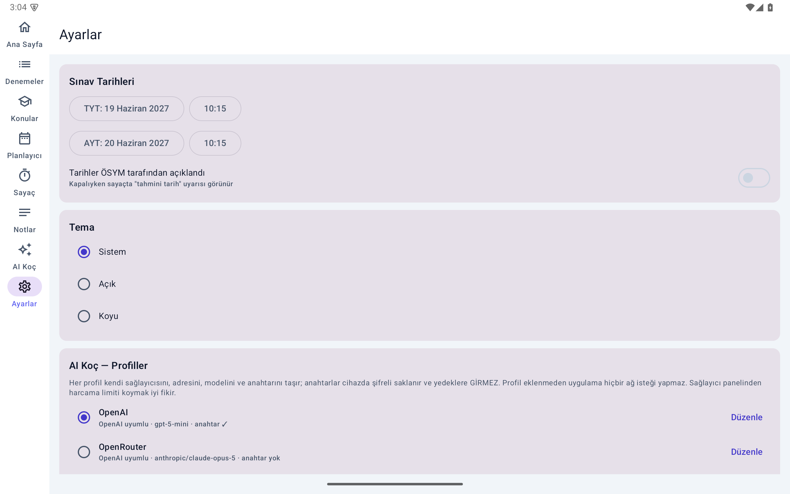 | 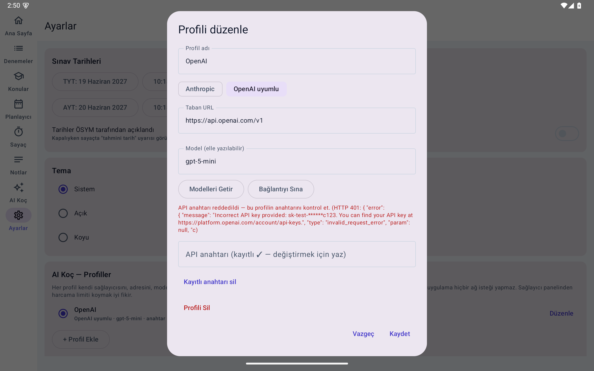 |
| **Ayarlar** — sınav tarihleri, tema, AI profilleri | **Bağlantıyı Sına** — dostça mesaj + HTTP kodu + sunucu hatası |
| 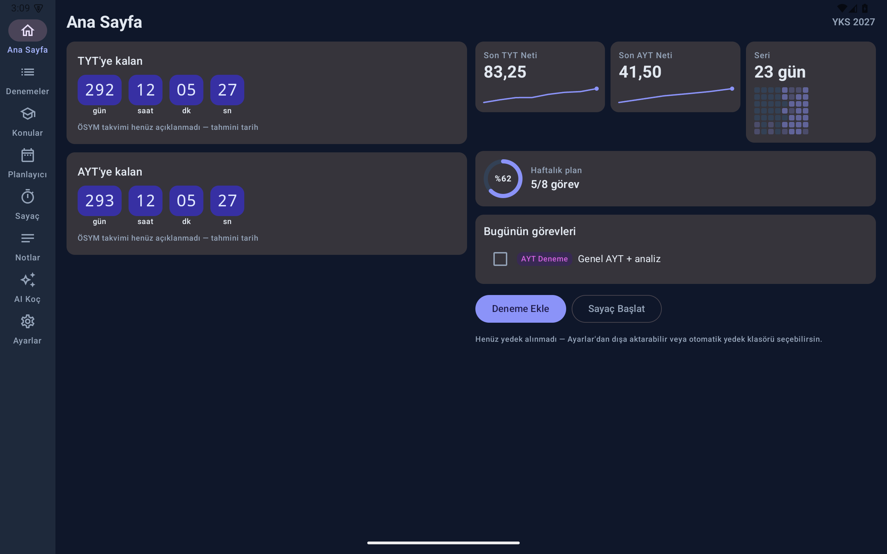 | 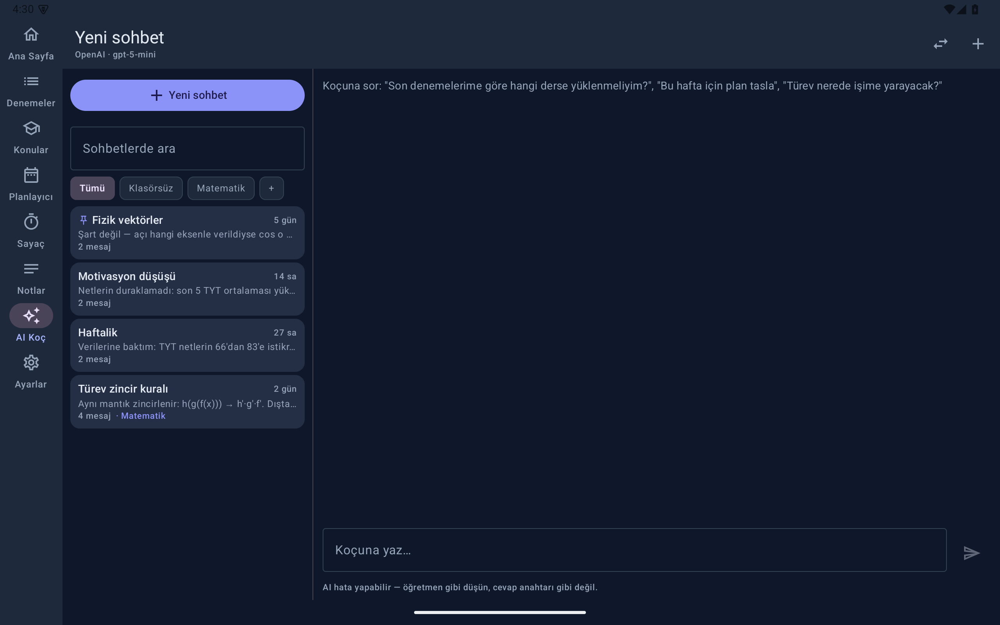 |
| **Koyu tema** — Ana Sayfa | **Koyu tema** — AI Koç paneli |

<a id="tr-gizlilik"></a>
## Gizlilik modeli

| Konu | Durum |
|---|---|
| Hesap / kayıt | Yok. Uygulama açılır ve çalışır. |
| Telemetri / analitik / reklam | Yok. Hiçbir SDK gömülü değil. |
| Ağ trafiği | Yalnızca **sizin eklediğiniz** AI profilinin uç noktasına. Profil yoksa sıfır istek. Ollama profiliyle trafik yerel ağı hiç terk etmez. |
| API anahtarları | Cihazda **Android Keystore** (AES-GCM) ile şifreli saklanır; profil başına ayrı anahtar. Yedek dosyalarına **asla** yazılmaz — geri yüklemeden sonra yeniden girilir. |
| AI'a giden veri | Yalnızca açıkça izin verirseniz kompakt bir istatistik özeti (son netler, plan tamamlama, zayıf konular, çalışma dk). Ayarlardan kapatılabilir. |
| Aile ile paylaşım | Öğrencinin elindedir: haftalık rapor metni (yalnız özet) veya Drive-eşitlenen klasöre otomatik yedek. Gizli izleme kanalı yoktur. |
| Cleartext HTTP | Yalnızca Ollama-LAN senaryosu için açıktır (`http://…:11434`). |

<a id="tr-kurulum"></a>
## Kurulum (kullanıcılar)

Hazır APK bu depoda tutulmaz; [Releases](../../releases) sayfasından indirin veya
kendiniz derleyin (aşağıda).

1. APK'yı tablete kopyalayın ve açın; "bilinmeyen kaynaklara izin ver" sorusunu
   onaylayın. Güncellemeler aynı imzayla üstüne kurulur, veri kaybolmaz.
2. İlk açılışta önerilen adımlar:
   - **Ayarlar → Sınav tarihleri:** ÖSYM takvimi açıklandığında gerçek tarihleri girin
     ve "tarihler açıklandı" işaretini koyun ("tahmini" uyarısı kalkar).
   - **Ayarlar → Yedekleme:** otomatik yedek klasörü seçin (isterseniz Drive ile
     eşitlenen paylaşımlı bir klasör — uzaktan takip için sıfır kod yolu budur).
   - **(İsteğe bağlı) AI Koç:** aşağıdaki bölüme bakın.
3. Bildirim izni sorulduğunda verin — sayaç bitiş bildirimi için gerekir (verilmezse
   sayaç yalnızca uygulama içinde tamamlanır).

<a id="tr-derleme"></a>
## Derleme (geliştiriciler)

**Gereksinimler:** JDK 17 ve Android SDK (platform 35 + 37 derleme platformu). En
kolay yol Android Studio'dur (ikisini de kendisi kurar): `File → Open` → sync → Run.

Komut satırı:

```bash
./gradlew :app:assembleDebug
```

```bash
./gradlew :app:testDebugUnitTest
```

macOS + Homebrew ile JDK gerekiyorsa: `brew install openjdk@17` ve
`export JAVA_HOME=/opt/homebrew/opt/openjdk@17/libexec/openjdk.jdk/Contents/Home`.

### Sürüm (release) derlemesi ve imzalama

- `keystore.properties` **yoksa** `./gradlew :app:assembleRelease` **imzasız** APK
  üretir (`app-release-unsigned.apk`) — derleme kırılmaz.
- Kendi imzalı sürümünüz için [`keystore.properties.example`](keystore.properties.example)
  dosyasını `keystore.properties` olarak kopyalayıp kendi keystore bilgilerinizi girin.
  Çıktı: `app/build/outputs/apk/release/app-release.apk`.
- ⚠️ **Keystore'unuzu ve şifrelerini depo dışında yedekleyin.** Kaybolursa aynı
  `applicationId` ile güncelleme yayınlayamazsınız; uygulama silinip yeniden kurulmak
  zorunda kalır (cihaz verisi gider — JSON yedek varsa geri gelir).
- `applicationId` (`com.yks2027.tracker`) **sabittir**: değişirse mevcut kurulumlar
  güncellenemez. Görünen ad ve yıl etiketi zaten ayarlardaki TYT tarihinden türetilir —
  YKS 2028 için kod değişikliği gerekmez.

### Teknoloji yığını

| Katman | Seçim |
|---|---|
| Dil / UI | Kotlin 2.3.21 · Jetpack Compose (BOM 2026.08) · Material 3 + `material3-adaptive` |
| Derleme | AGP 9.3.2 (gömülü Kotlin — `org.jetbrains.kotlin.android` uygulanmaz) · Gradle 9.7.1 · KSP · minSdk 29 / targetSdk 35 / compileSdk 37 |
| Veri | Room 2.8.4 (şema v5, `exportSchema` açık, elle yazılmış doğrulanmış migration'lar) · DataStore Preferences · kotlinx.serialization |
| DI / Grafik | Hilt 2.60.1 · Vico 3.3.1 + özel Canvas mini-viz kiti (sparkline, halka, dilimli çubuk, ısı şeridi) |
| AI | Resmî Anthropic Java SDK 2.59.0 · OkHttp tabanlı OpenAI-uyumlu istemci |
| Diğer | Glance (widget) · mikepenz multiplatform-markdown-renderer (Notlar) |

### Proje yapısı

```
app/src/main/java/com/yks2027/tracker/
├── core/
│   ├── ai/          # Profiller, şifreli anahtar deposu, Anthropic + OpenAI-uyumlu
│   │                # istemciler, hata eşleme, AI karne çıkarımı
│   ├── backup/      # JSON yedek v5 (v1–v4 okur), CSV codec
│   ├── database/    # Room: 13 tablo, DAO'lar, MIGRATION_1_2 … MIGRATION_4_5
│   ├── datastore/   # Ayarlar + sayaç durum makinesi kalıcılığı
│   ├── model/       # Saf alan mantığı: net matematiği, hafta anahtarı, ısı şeridi…
│   ├── time/        # Enjekte edilebilir IstanbulClock
│   └── ui/          # Tema, jetonlar, MiniViz + Vico grafik sarmalayıcıları
├── feature/
│   ├── dashboard/  exams/  topics/  planner/  timer/
│   ├── aikoc/       # Sohbet + oturum paneli (SessionListLogic saf katman)
│   ├── notes/  importexport/  settings/
└── widget/          # Glance geri sayım widget'ı
```

Ayrıntılı mimari için: [docs/ARCHITECTURE.md](docs/ARCHITECTURE.md).

<a id="tr-ai"></a>
## AI Koç'u yapılandırma

1. **Ayarlar → AI Koç — Profiller → Yeni profil** deyin, bir şablon seçin.
2. API anahtarınızı girin (anahtar cihazda şifrelenir, yedeklere girmez).
3. **Bağlantıyı Sına** ile doğrulayın; **Modelleri Getir** ile güncel model listesinden
   seçim yapın.

| Şablon | Protokol | Not |
|---|---|---|
| Claude (Anthropic) | Anthropic (resmî SDK) | Varsayılan `claude-opus-5`; ekonomik: `claude-sonnet-5`, `claude-haiku-4-5`. Karne okuma (görsel/PDF) yalnız bu protokolde. |
| OpenAI | OpenAI-uyumlu | Varsayılan `gpt-5-mini` |
| Google Gemini | OpenAI-uyumlu uç | Varsayılan `gemini-3.7-flash` |
| xAI Grok | OpenAI-uyumlu | Varsayılan `grok-4.6` |
| OpenRouter | OpenAI-uyumlu | `openrouter/auto` — tek anahtarla çok sağlayıcı |
| OpenCode Zen | OpenAI-uyumlu | `https://opencode.ai/zen/v1` |
| Ollama (LAN) | OpenAI-uyumlu | `http://<sunucu-ip>:11434/v1` — trafik evden çıkmaz; küçük modeller Türkçe mat/fen koçluğunda zayıftır |
| Özel | İkisi de | Taban URL + model elle |

Şablon varsayılanları 2026-08-30'da doğrulandı; sağlayıcılar model adlarını
değiştirebilir — güncel liste her zaman **Modelleri Getir**'dedir.

> 💸 **Maliyet:** anahtar sizin anahtarınızdır ve kullanım size faturalanır. Sağlayıcı
> panelinden **harcama limiti** koymanızı şiddetle öneririz.
> 🧮 **Doğruluk:** LLM'ler zor matematikte hata yapabilir. AI Koç bir çalışma
> arkadaşıdır; cevap anahtarı değildir.

<a id="tr-veri"></a>
## Veri modeli ve yedekleme

Room şeması **v5** — 13 tablo:

| Tablo | İçerik |
|---|---|
| `exams`, `exam_sections` | Deneme başlığı + ders başına ham D/Y (boş ve net türetilir) |
| `exam_topic_marks`, `exam_topic_notes` | Deneme başına konu işaretleri (Y/B + hata türü) ve ders notları |
| `topic_status` | Konu başına çalıştım/soru/tekrar durumu |
| `plan_weeks`, `plan_tasks` | Hafta anahtarlı plan; görevlerde hedef + gerçek çözülen |
| `focus_sessions` | Sayaç/kronometre oturumları (aktif ms, kategori, görev bağı) |
| `chat_threads`, `chat_messages`, `chat_folders` | AI Koç geçmişi; sabitleme + klasörler (FK `SET NULL` — klasör silmek sohbeti silmez) |
| `ai_profiles` | AI profil meta verisi (**anahtarlar burada değil** — şifreli DataStore'da) |
| `notes` | Markdown notlar |

- `exportSchema` açıktır; `app/schemas/` altındaki 1–5 şema dosyaları depoya dahildir.
- Migration zinciri `MIGRATION_1_2 … MIGRATION_4_5` elle yazılmıştır ve hem üretilen
  şemayla bit-bit hem de emülatörde gerçek veriyle yerinde yükseltme olarak doğrulanır.
  (4→5, SQLite `ALTER TABLE` ile FK ekleyemediği için `chat_threads`'i standart
  yeniden-kurma reçetesiyle taşır — ayrıntı: [ARCHITECTURE](docs/ARCHITECTURE.md).)
- **JSON yedek formatı v5**, v1–v4 dosyalarını da okur. Geri yükleme "değiştir"
  anlamındadır ama önce otomatik bir güvenlik anlık görüntüsü alınır. API anahtarları
  yedeklere **asla** girmez.

<a id="tr-csv"></a>
## CSV formatı

Dışa ve içe aktarma aynı biçimi kullanır — UTF-8 (BOM'lu), ayraç `;` (netlerdeki
ondalık virgülle çakışmaması için), başlık satırı zorunlu:

```text
tarih;tur;ad;yayinevi;ders;soru;dogru;yanlis;bos;net
2026-08-22;TYT_FULL;TYT Deneme 8;Limit;TYT_MATEMATIK;40;28;8;4;26,00
```

- Bir satır = bir dersin sonucu; tam deneme = aynı `tarih+tur+ad` ile ders başına satır.
- `tur`: `TYT_FULL | AYT_SAY_FULL | BRANS_TYT | BRANS_AYT` · `ders`: `TYT_TURKCE`,
  `TYT_SOSYAL`, `TYT_MATEMATIK`, `TYT_FEN`, `AYT_MATEMATIK`, `AYT_FIZIK`, `AYT_KIMYA`,
  `AYT_BIYOLOJI`.
- `bos` ve `net` türetilmiş kolonlardır; içe aktarmada **yok sayılır** (yeniden
  hesaplanır). `;` veya `"` içeren alanlar çift tırnakla kaçırılır (Excel standardı).
- İçe aktarma **ekler**, silmez; aynı gün+tür varsa satır mükerrer işaretlenir ve
  varsayılan seçimsiz gelir. Bozuk satırlar numarasıyla raporlanır, kalanı aktarılır.

<a id="tr-test"></a>
## Test ve doğrulama disiplini

- **75 unit test** (v1.3.0 itibarıyla): net matematiği (negatif ve kesirli örnekler
  dahil), hafta devri, sayaç durum makinesi, CSV gidiş-dönüşü, AI çıkarım JSON
  sözleşmesi, profil migrasyonu, oturum sıralama/filtre/arama mantığı, yedek geri
  yükleme klasör koruması.
- Her sürümde: migration üretilen şemayla **bit-bit** karşılaştırılır **ve** emülatörde
  önceki sürümün gerçek verisi üzerine **yerinde yükseltme** ile canlı doğrulanır
  (ör. v1.2→v1.3: 4 gerçek sohbet, sıfır kayıp).
- İmzalı release ile açık + koyu tam ekran turu; AI hata yolları (401 / 404 / ağ yok)
  gerçek uçlara karşı denenir.
- Sürüm başına ayrıntılı kayıtlar: [Geliştirme Günlüğü](docs/GELISTIRME-GUNLUGU.md).

<a id="tr-belgeler"></a>
## Belgeler

| Belge | İçerik |
|---|---|
| [docs/PRD-v2.md](docs/PRD-v2.md) | Ürün gereksinimleri: doğrulanmış YKS alan bilgisi (kaynaklarıyla), modül spesifikasyonları, kabul kriterleri, v1'den değişiklikler. §17 sürüm notlarıdır. |
| [docs/ARCHITECTURE.md](docs/ARCHITECTURE.md) | Mimari: veri modeli, migration reçeteleri, yedek formatı, sayaç durum makinesi, AI katmanı, içe aktarma hattı. |
| [CHANGELOG.md](CHANGELOG.md) | Sürüm geçmişi (v1.0.0 → v1.3.0). |
| [docs/GELISTIRME-GUNLUGU.md](docs/GELISTIRME-GUNLUGU.md) | Tarihsel geliştirme/doğrulama günlüğü (sürüm başına test kayıtları). |

<a id="tr-kapsam"></a>
## Bilinçli kapsam dışı

Bunlar unutulmadı; **bilerek** yapılmadı (gerekçeler PRD §15'te):

- **Puan/sıralama tahmini** — yıllık ÖSYM katsayıları ve OBP olmadan çevrimdışı puan
  hesabı yanlış kesinlik üretir; dürüst metrik nettir.
- **Hedef net panoları** — baskı aracı olmasın diye.
- **Firebase / hesaplı canlı takip** — şeffaflık ilkesiyle çelişir; paylaşım öğrencinin
  elinde kalır.
- PDF rapor, soru bankası, flash kartlar, sosyal özellikler, bulut eşitleme.

<a id="tr-katki"></a>
## Katkı

Bu, tek bir öğrenci için yazılmış kişisel bir aile projesidir. Hata bildirimleri ve
küçük düzeltmeler memnuniyetle; büyük özellik istekleri büyük olasılıkla "bilinçli
kapsam dışı" listesine takılacaktır. Çatallayıp (fork) kendi kardeşinize göre
uyarlamanız en doğru katkıdır. Kod ve arayüz dili Türkçedir.

<a id="tr-lisans"></a>
## Lisans ve teşekkürler

[MIT lisansı](LICENSE) — dilediğiniz gibi kullanın; sorumluluk kabul edilmez.
ÖSYM ve MEB ile hiçbir bağı yoktur; "YKS" yalnızca sınavı tanımlamak için kullanılır.

Teşekkürler: [Vico](https://github.com/patrykandpatrick/vico) (grafikler),
[Anthropic Java SDK](https://github.com/anthropics/anthropic-sdk-java),
[multiplatform-markdown-renderer](https://github.com/mikepenz/multiplatform-markdown-renderer),
Jetpack Compose / Room / Hilt ekipleri.

---

<a id="english"></a>

# 🇬🇧 English

## Table of contents

- [What is this?](#en-what)
- [Design principles](#en-principles)
- [Features](#en-features)
- [Screenshots](#en-screens)
- [Privacy model](#en-privacy)
- [Installing (users)](#en-install)
- [Building (developers)](#en-build)
- [Configuring the AI coach](#en-ai)
- [Data model & backups](#en-data)
- [CSV format](#en-csv)
- [Testing & verification discipline](#en-testing)
- [Documentation](#en-docs)
- [Deliberately out of scope](#en-scope)
- [Contributing](#en-contrib)
- [License & acknowledgements](#en-license)

<a id="en-what"></a>
## What is this?

YKS Takip ("YKS Tracker") is a study-tracking app I built **for my younger brother**,
who is preparing for **YKS 2027** — Turkey's national university entrance exam — in the
science track (Sayısal). It runs sideloaded on a Samsung Galaxy Tab S9 FE+; it is not
on the Play Store and doesn't aim to be. The repository is open so anyone can build the
same thing for their own sibling or student.

Quick domain primer for non-Turkish readers: YKS consists of **TYT** (120 questions,
165 min) and, for science-track students, **AYT** (80 questions, 180 min). Scoring uses
**nets**: `net = correct − wrong/4`, in quarter-point precision — and yes, nets can be
negative. Students take frequent commercial mock exams ("deneme") and track net trends
per subject; that loop is the heart of this app.

The app answers five questions:

1. **How are my mock exams going?** — Full TYT/AYT and single-subject (branş) mocks;
   raw correct/wrong entry per subject, net trends, accuracy, weak-topic ranking.
2. **What am I studying this week?** — A week-keyed 7-day board with copy-last-week and
   honest "questions actually solved" capture.
3. **How much did I study?** — Countdown timer + stopwatch; every session is logged;
   weekly study time per subject, streaks, an 8-week activity heat strip.
4. **Which topics are weak?** — An embedded ~140-topic curriculum catalog; per-exam
   topic marks (wrong/blank + error type: knowledge/calculation/attention/time);
   a ranked weak-topics view.
5. **How long until the exam?** — Dual TYT + AYT countdowns (flagged "estimated" until
   ÖSYM confirms the calendar) plus a home-screen widget.

On top sits an optional **AI coach**: bring your own API key (BYOK), and the coach
receives a compact summary of local stats (recent nets, plan completion, weak topics,
study minutes) so its advice is personal. Until a key is configured the tab is hidden
and the app generates **zero network traffic**.

<a id="en-principles"></a>
## Design principles

Written down before the code, enforced in every release (they are the core of the
[PRD](docs/PRD-v2.md)):

- **Offline-first.** No accounts, no sign-up, no cloud. The `INTERNET` permission
  exists solely for the AI endpoint *you* configure.
- **No telemetry.** No analytics, crash reporting, or ad SDKs of any kind.
- **Honest numbers.** Nets are never clamped to zero (2 correct / 20 wrong = **−3.00**);
  "questions solved" comes from what the student actually enters on completion, not
  from summed targets; there is deliberately no score/rank estimator (offline score
  math without each year's ÖSYM coefficients is false precision — nets are the honest
  metric).
- **Transparent sharing.** Sharing with family stays in the student's hands: they share
  the weekly report *text* themselves (aggregates only; chats and notes never), or
  point the auto-backup folder at a Drive-synced shared folder. There is no hidden
  monitoring channel, and there never will be.
- **Zero tolerance for data loss.** Schema changes are additive-only; every migration
  is verified both byte-for-byte against the generated schema and as a live in-place
  upgrade over real data on an emulator. The backup reader accepts every older format.
- **Every import passes a human.** No CSV- or AI-sourced data ever reaches the
  database without a preview/confirm screen.

<a id="en-features"></a>
## Features

### 📊 Mock-exam tracking & analytics
- **Four exam kinds:** full TYT (120 q), full AYT-science (80 q), and single-subject
  TYT/AYT mocks with publisher-variable question counts.
- **Raw correct/wrong entry** per subject; blank and net are derived. Live preview,
  `C+W ≤ count` validation at the field boundary, focus auto-advance — eight numbers in
  under a minute.
- **Net math is integer math:** stored in quarter units (`4·C − W`), so floating-point
  bugs are impossible; negative nets flow end-to-end.
- **Duplicate warning** for same day + kind; editing and **undoable delete**.
- **Analytics** (Vico charts): total net trend for TYT/AYT (index-based x-axis —
  mocks cluster, a date axis would create voids), per-subject net trend, accuracy %,
  blank-vs-wrong columns, KPIs including a last-5 average, and KPI **sparklines**.
- **Weak Topics:** ranked from per-exam topic marks; each bar's length is the wrong
  count and its segments are the error-type breakdown.

### 🗓 Weekly planner
- A 7-day board keyed to Monday (Europe/Istanbul); when the week rolls over, the old
  week **becomes history automatically** — there is no destructive reset.
- One-tap **"copy last week's plan"** on first open of a new week (tasks copied
  unticked).
- 10 fixed categories whose colors are theme tokens with light/dark variants.
- On completing a task the app asks for the **actual number of questions solved**
  (numpad pre-filled with the target, so one tap confirms). Weekly totals use this
  real number.
- **Past Weeks:** read-only history (completion %, target/solved, study minutes), an
  8-week dual-axis trend (study-minute columns + completed-task line), and a
  **"Share weekly report"** action per week.

### ⏱ Timer & stopwatch
- Countdown (1–300 min) **and**, since v1.2, a count-up stopwatch; dial with a
  progress ring.
- Reliability is a state machine: state is persisted to DataStore only on transitions;
  a foreground service shows a live chronometer notification while running; completion
  is guaranteed by an exact alarm (`USE_EXACT_ALARM`) that fires even if the process
  is killed or the device is dozing; a `BOOT_COMPLETED` receiver reschedules or
  finalizes ("timer ended while the device was off") after a reboot.
- Every session ≥60 s is logged to `focus_sessions` (optional category and task link);
  breaks are suggested but **never** recorded as study time.

### 📚 Topic tracking
- An embedded catalog of ~140 curriculum topics (the current curriculum remains valid
  for 2027; the new Maarif question model starts in 2028 — the catalog was chosen
  accordingly).
- Per-topic studied / practiced / reviewed states, per-subject progress rings, and
  wrong-count badges fed by exam topic marks.

### 🤖 AI coach (optional, BYOK)
- **Profiles:** each profile carries a name + protocol + base URL + model + its own
  encrypted key. Templates: Claude, OpenAI, Gemini, xAI Grok, OpenRouter, OpenCode
  Zen, Ollama (LAN), and Custom. The active profile is switchable from the chat's top
  bar.
- **Claude speaks through the official Anthropic Java SDK** (never an OpenAI-compat
  shim); everything else goes through a single OpenAI-compatible client. The
  **Ollama** option keeps traffic entirely on your LAN (with the honest caveat that
  small local models are markedly weaker at Turkish math/science tutoring).
- **Test Connection** hits the provider's real `models` endpoint and reports failures
  in three layers: a friendly Turkish explanation + the HTTP status + the server's own
  error body. **Fetch Models** pulls the live model list with search and pick.
- Responses **stream** and can be stopped. With permission, the coach receives a
  compact local-stats summary as context (toggle in Settings).
- Any answer can be saved to Notes with one tap. LLMs can err on hard math — this is
  a study companion, not an answer key.
- **Sessions (v1.3):** a permanent left pane on wide screens, a bottom sheet on
  compact ones. All threads are listed — pinned first, then by last *message*
  activity. Long-press for rename (a manual name is never overwritten by the
  auto-title), pin, move to folder, and delete with **Undo**. **Folders** never delete
  threads (deleting a folder drops its threads back to "Unfiled"). **Search** covers
  titles + message content, works across folders, and results carry a folder badge.

### 📥 Import / export
- **JSON backup** via the system file picker: full state; restore takes an automatic
  safety snapshot first. **Weekly auto-backup** writes to a folder you pick and keeps
  the last 8 files; the dashboard reminds you if backups go stale.
- **CSV export + share** and **CSV import** with a preview table, duplicate flagging
  (same day + kind), and additive inserts — imports never delete.
- **AI report-card reading:** a photo / PDF / pasted text goes to Claude (Anthropic
  profiles only; images downscaled to ≤1568 px, PDFs ≤20 MB) and the result opens in a
  **pre-filled exam form for confirmation** — nothing is ever auto-saved.

### 📝 Notes
- Markdown notes with live preview; one-tap note creation from AI coach answers.

### 🎨 UI
- Light / Dark / System theme; every category and chart color is a two-theme token.
- Adaptive layout via `material3-adaptive`: tablet-landscape gets permanent rails and
  side panes, portrait/compact gets bottom bars and sheets. Touch targets ≥48 dp.
- Numbers are always written next to charts; every screen has an empty state.
- A Glance home-screen **countdown widget**.

<a id="en-screens"></a>
## Screenshots

The gallery above in the [Turkish section](#tr-ekranlar) shows all screens: dashboard,
analytics, weak topics, topic tracking, planner, past weeks, timer, notes, the v1.3
AI-coach session pane with folders and cross-folder search, the compact bottom sheet,
CSV import preview, and dark theme. (UI language is Turkish.)

<a id="en-privacy"></a>
## Privacy model

| Concern | Status |
|---|---|
| Accounts / sign-up | None. The app opens and works. |
| Telemetry / analytics / ads | None. No such SDK is embedded. |
| Network traffic | Only to the endpoint of an AI profile **you** add. No profile → zero requests. With an Ollama profile, traffic never leaves your LAN. |
| API keys | Encrypted on-device with the **Android Keystore** (AES-GCM), one key per profile. **Never** written to backups — re-enter after a restore. |
| Data sent to AI | Only a compact stats summary (recent nets, plan completion, weak topics, study minutes), and only if you allow it. Toggle in Settings. |
| Family sharing | In the student's hands: weekly report text (aggregates only) or auto-backups into a Drive-synced folder. No hidden monitoring channel. |
| Cleartext HTTP | Enabled solely for the Ollama-on-LAN scenario (`http://…:11434`). |

<a id="en-install"></a>
## Installing (users)

Prebuilt APKs are not stored in the repository; grab one from
[Releases](../../releases) or build your own (below).

1. Copy the APK to the tablet and open it; accept the "allow from unknown sources"
   prompt. Updates install over the top with the same signature — no data loss.
2. Recommended first-run steps:
   - **Settings → Exam dates:** when ÖSYM announces the official calendar, enter the
     real dates and set the "dates confirmed" flag (removes the "estimated" banner).
   - **Settings → Backup:** pick an auto-backup folder (optionally a Drive-synced
     shared folder — that's the zero-code remote-visibility path).
   - **(Optional) AI coach:** see the section below.
3. Grant the notification permission when asked — the timer's completion notification
   needs it (without it the timer still completes in-app).

<a id="en-build"></a>
## Building (developers)

**Requirements:** JDK 17 and the Android SDK (platform 35, compile platform 37). The
easiest path is Android Studio (installs both itself): `File → Open` → sync → Run.

Command line:

```bash
./gradlew :app:assembleDebug
```

```bash
./gradlew :app:testDebugUnitTest
```

On macOS with Homebrew, if you need a JDK: `brew install openjdk@17`, then
`export JAVA_HOME=/opt/homebrew/opt/openjdk@17/libexec/openjdk.jdk/Contents/Home`.

### Release builds & signing

- Without a `keystore.properties`, `./gradlew :app:assembleRelease` produces an
  **unsigned** APK (`app-release-unsigned.apk`) — the build never breaks.
- For your own signed release, copy
  [`keystore.properties.example`](keystore.properties.example) to
  `keystore.properties` and fill in your keystore. Output:
  `app/build/outputs/apk/release/app-release.apk`.
- ⚠️ **Back up your keystore and its passwords outside the repo.** Losing them means
  you can never ship an update for the same `applicationId` again; the app would have
  to be uninstalled (losing on-device data — recoverable only from a JSON backup).
- The `applicationId` (`com.yks2027.tracker`) is **frozen**: changing it breaks
  updates for existing installs. The display name and year label already derive from
  the TYT date in Settings — no code change is needed for YKS 2028.

### Tech stack

| Layer | Choice |
|---|---|
| Language / UI | Kotlin 2.3.21 · Jetpack Compose (BOM 2026.08) · Material 3 + `material3-adaptive` |
| Build | AGP 9.3.2 (built-in Kotlin — `org.jetbrains.kotlin.android` must not be applied) · Gradle 9.7.1 · KSP · minSdk 29 / targetSdk 35 / compileSdk 37 |
| Data | Room 2.8.4 (schema v5, `exportSchema` on, hand-written verified migrations) · DataStore Preferences · kotlinx.serialization |
| DI / Charts | Hilt 2.60.1 · Vico 3.3.1 + a custom Canvas mini-viz kit (sparklines, rings, segmented bars, heat strip) |
| AI | Official Anthropic Java SDK 2.59.0 · OkHttp-based OpenAI-compatible client |
| Misc | Glance (widget) · mikepenz multiplatform-markdown-renderer (Notes) |

### Project layout

```
app/src/main/java/com/yks2027/tracker/
├── core/
│   ├── ai/          # Profiles, encrypted key store, Anthropic + OpenAI-compat
│   │                # clients, error mapping, AI report-card extraction
│   ├── backup/      # JSON backup v5 (reads v1–v4), CSV codec
│   ├── database/    # Room: 13 tables, DAOs, MIGRATION_1_2 … MIGRATION_4_5
│   ├── datastore/   # Settings + timer state-machine persistence
│   ├── model/       # Pure domain logic: net math, week keying, heat strip…
│   ├── time/        # Injectable IstanbulClock
│   └── ui/          # Theme, tokens, MiniViz + Vico chart wrappers
├── feature/
│   ├── dashboard/  exams/  topics/  planner/  timer/
│   ├── aikoc/       # Chat + session pane (pure SessionListLogic layer)
│   ├── notes/  importexport/  settings/
└── widget/          # Glance countdown widget
```

Deep dive: [docs/ARCHITECTURE.md](docs/ARCHITECTURE.md).

<a id="en-ai"></a>
## Configuring the AI coach

1. Go to **Settings → AI Coach — Profiles → New profile** and pick a template.
2. Enter your API key (encrypted on-device, never in backups).
3. Verify with **Test Connection**; pick from the live list with **Fetch Models**.

| Template | Protocol | Notes |
|---|---|---|
| Claude (Anthropic) | Anthropic (official SDK) | Default `claude-opus-5`; budget: `claude-sonnet-5`, `claude-haiku-4-5`. Report-card reading (image/PDF) works only on this protocol. |
| OpenAI | OpenAI-compatible | Default `gpt-5-mini` |
| Google Gemini | OpenAI-compatible endpoint | Default `gemini-3.7-flash` |
| xAI Grok | OpenAI-compatible | Default `grok-4.6` |
| OpenRouter | OpenAI-compatible | `openrouter/auto` — many providers behind one key |
| OpenCode Zen | OpenAI-compatible | `https://opencode.ai/zen/v1` |
| Ollama (LAN) | OpenAI-compatible | `http://<server-ip>:11434/v1` — traffic never leaves home; small local models are weak at Turkish math/science tutoring |
| Custom | Either | Manual base URL + model |

Template defaults were verified on 2026-08-30; providers rename models over time — the
authoritative list is always **Fetch Models**.

> 💸 **Cost:** the key is yours and usage bills to you. Set a **spend cap** in the
> provider's dashboard.
> 🧮 **Accuracy:** LLMs can err on hard math. The coach is a study companion, not an
> answer key.

<a id="en-data"></a>
## Data model & backups

Room schema **v5** — 13 tables:

| Table | Contents |
|---|---|
| `exams`, `exam_sections` | Exam header + raw correct/wrong per subject (blank & net derived) |
| `exam_topic_marks`, `exam_topic_notes` | Per-exam topic marks (wrong/blank + error type) and subject notes |
| `topic_status` | Per-topic studied/practiced/reviewed state |
| `plan_weeks`, `plan_tasks` | Week-keyed plan; tasks carry target + actually-solved counts |
| `focus_sessions` | Timer/stopwatch sessions (active ms, category, task link) |
| `chat_threads`, `chat_messages`, `chat_folders` | AI-coach history; pinning + folders (FK `SET NULL` — deleting a folder never deletes threads) |
| `ai_profiles` | AI profile metadata (**keys live elsewhere** — in encrypted DataStore) |
| `notes` | Markdown notes |

- `exportSchema` is on; schema files 1–5 under `app/schemas/` are committed.
- The migration chain `MIGRATION_1_2 … MIGRATION_4_5` is hand-written and verified
  both byte-for-byte against the generated schema and as live in-place upgrades over
  real data on an emulator. (4→5 rebuilds `chat_threads` via the standard SQLite
  table-recreation recipe, because `ALTER TABLE` cannot add a foreign key — details in
  [ARCHITECTURE](docs/ARCHITECTURE.md).)
- **JSON backup format v5** still reads v1–v4 files. Restore means "replace", but an
  automatic safety snapshot is taken first. API keys are **never** included.

<a id="en-csv"></a>
## CSV format

Export and import share one format — UTF-8 with BOM, `;` separator (Turkish decimal
commas live inside net values), header row required:

```text
tarih;tur;ad;yayinevi;ders;soru;dogru;yanlis;bos;net
2026-08-22;TYT_FULL;TYT Deneme 8;Limit;TYT_MATEMATIK;40;28;8;4;26,00
```

- One row = one subject's result; a full mock = one row per subject sharing
  `tarih+tur+ad` (date+kind+name).
- `tur` (kind): `TYT_FULL | AYT_SAY_FULL | BRANS_TYT | BRANS_AYT` · `ders` (subject):
  `TYT_TURKCE`, `TYT_SOSYAL`, `TYT_MATEMATIK`, `TYT_FEN`, `AYT_MATEMATIK`,
  `AYT_FIZIK`, `AYT_KIMYA`, `AYT_BIYOLOJI`.
- `bos` (blank) and `net` are derived columns and **ignored on import** (recomputed).
  Fields containing `;` or `"` use standard Excel-style quoting.
- Import is **additive**, never deletes; rows matching an existing day+kind are
  flagged as duplicates and deselected by default. Malformed lines are reported with
  their line numbers while the rest still import.

<a id="en-testing"></a>
## Testing & verification discipline

- **75 unit tests** (as of v1.3.0): net math (including negative and fractional
  cases), week rollover, the timer state machine, CSV round-trips, the AI-extraction
  JSON contract, profile migration, session ordering/filter/search logic, and the
  backup-restore folder guard.
- Every release: migrations are compared **byte-for-byte** against the generated
  schema **and** verified live as an in-place upgrade over the previous version's real
  data on an emulator (e.g. v1.2→v1.3: four real chat threads, zero loss).
- A full light + dark screen tour on the signed release; AI failure paths
  (401 / 404 / no network) exercised against real endpoints.
- Per-release records: [development log](docs/GELISTIRME-GUNLUGU.md) (Turkish).

<a id="en-docs"></a>
## Documentation

| Document | Contents |
|---|---|
| [docs/PRD-v2.md](docs/PRD-v2.md) | Product requirements (English): verified YKS domain facts with sources, module specs, acceptance criteria, changes from v1. §17 is the release log (Turkish). |
| [docs/ARCHITECTURE.md](docs/ARCHITECTURE.md) | Architecture: data model, migration recipes, backup format, timer state machine, AI layer, import pipeline. |
| [CHANGELOG.md](CHANGELOG.md) | Release history (v1.0.0 → v1.3.0). |
| [docs/GELISTIRME-GUNLUGU.md](docs/GELISTIRME-GUNLUGU.md) | Historical development/verification log (Turkish). |

<a id="en-scope"></a>
## Deliberately out of scope

Not forgotten — **declined**, with rationale in PRD §15:

- **Score/rank estimation** — offline score math without each year's ÖSYM
  coefficients produces false precision; nets are the honest metric.
- **Target-net dashboards** — to avoid becoming a pressure instrument.
- **Firebase / account-based live monitoring** — conflicts with the transparency
  principle; sharing stays in the student's hands.
- PDF reports, question banks, flashcards, social features, cloud sync.

<a id="en-contrib"></a>
## Contributing

This is a personal family project built for one student. Bug reports and small fixes
are welcome; large feature requests will most likely hit the "deliberately out of
scope" list. Forking it and adapting it for your own sibling is the best contribution.
Note that the codebase's UI language is Turkish.

<a id="en-license"></a>
## License & acknowledgements

[MIT](LICENSE) — use it however you like; no warranty. Not affiliated with ÖSYM or
MEB; "YKS" is used purely to describe the exam.

Thanks to [Vico](https://github.com/patrykandpatrick/vico) (charts), the
[Anthropic Java SDK](https://github.com/anthropics/anthropic-sdk-java),
[multiplatform-markdown-renderer](https://github.com/mikepenz/multiplatform-markdown-renderer),
and the Jetpack Compose / Room / Hilt teams.
