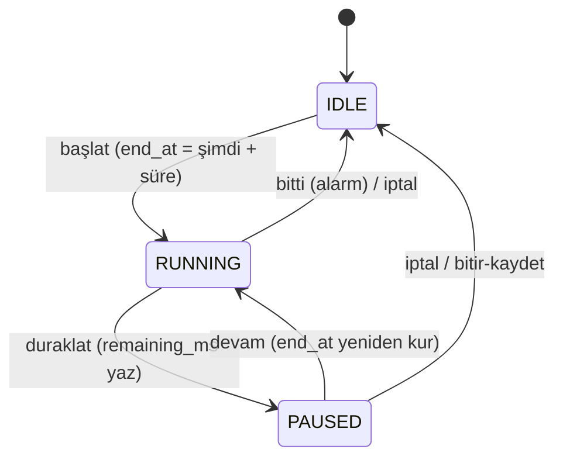
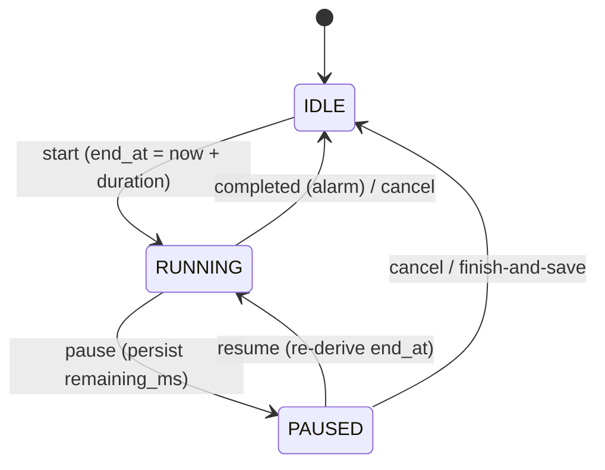

# Mimari / Architecture

**[🇹🇷 Türkçe](#turkce) · [🇬🇧 English](#english)**

---

<a id="turkce"></a>
# 🇹🇷 Türkçe

## 1. Genel bakış

Tek Gradle modülü (`:app`), klasik **MVVM + repository** düzeni: Room ve DataStore
`Flow` yayınlar, ViewModel'ler bunları `StateFlow`'a katlar, Compose ekranları
yalnızca durum çizer. Bağımlılıklar Hilt ile enjekte edilir; zaman her yerde
enjekte edilebilir `IstanbulClock` üzerinden okunur (testlerde sahte saat).

Yol gösteren iki pratik ilke:

- **Karar mantığı saf Kotlin'e çekilir.** Sıralama/filtre/arama (`SessionListLogic`),
  net matematiği, hafta anahtarlama, CSV codec'i, AI çıkarım ayrıştırıcısı, ısı şeridi
  kovalama, legacy-profil migrasyon kararı… hepsi Android'siz sınıflardır — 75 unit
  testin hedefi bunlardır. ViewModel'ler ince kalır.
- **Yalnızca yeniden hesaplanamayan girdi saklanır.** Boş, net, doğruluk, KPI'lar,
  haftalık toplamlar okuma anında türetilir (veri ölçeği: yılda ~150 deneme — önemsiz).
  Bu, "türetilmiş kolon tutarsızlığı" diye bir hata sınıfını baştan yok eder.

## 2. Paket haritası

```
com.yks2027.tracker
├── core
│   ├── ai          AiTypes (protokoller, şablonlar, hata eşleme) · AiProfilesRepository
│   │               AiSecretsRepository (Keystore AES-GCM) · AnthropicProvider
│   │               OpenAiCompatProvider · AiClient (profil yönlendirme) · ExamExtractor
│   ├── backup      BackupManager (JSON v5) · CsvCodec
│   ├── database    Entities · Daos · YksDatabase (v5, migration zinciri)
│   ├── datastore   SettingsRepository · TimerStateRepository
│   ├── model       NetMath · WeekKeys · HeatStripBuckets · sabit taksonomiler
│   ├── time        IstanbulClock
│   └── ui          Tema/jetonlar · charts/MiniViz · charts/VicoCharts
├── feature
│   ├── dashboard · exams · topics · planner · timer
│   ├── aikoc       AiKocScreen (VM) · SessionsPane · SessionListLogic (saf)
│   ├── notes · importexport · settings
└── widget          Glance geri sayım widget'ı
```

## 3. Veri modeli (şema v6 — 13 tablo)

| Tablo | Anahtar noktalar |
|---|---|
| `exams` | `exam_kind` TEXT enum (`TYT_FULL`, `AYT_SAY_FULL`, `BRANS_TYT`, `BRANS_AYT`), `taken_at_day` epoch-gün (Istanbul), ad/yayınevi/süre/not |
| `exam_sections` | Deneme başına ders satırı: `subject` TEXT enum (8 ders), `question_count` **saklanır** (branş denemelerinde yayınevine göre değişir), ham `correct_count`/`wrong_count`. Benzersiz `(exam_id, subject)`; FK CASCADE |
| `exam_topic_marks` | Konu işareti: `topic_id` (gömülü katalog), `wrong_count`, `blank_count`, `error_type` (Bilgi/İşlem/Dikkat/Süre); FK CASCADE |
| `exam_topic_notes` | Deneme+ders başına serbest not; FK CASCADE |
| `topic_status` | Konu başına `studied`/`practiced`/`reviewed` bayrakları (PK `topic_id`); v2.1: `needs_review`, `confidence` (0 yok / 1 zayıf / 2 orta / 3 iyi), `last_studied_at?` |
| `plan_weeks` | PK `week_start_day` = Pazartesi epoch-gün (Istanbul) — hafta anahtarı, örtük arşivin kendisi |
| `plan_tasks` | `day_of_week` ISO 1–7, sabit `category` enum, `target_questions` + **`solved_questions`** (dürüst metrik), `order_index`; FK CASCADE |
| `focus_sessions` | `active_ms` **saklanır** (duraklatma geçmişi geri kurulamaz), `planned_min` (kronometrede 0), `category?`, `task_id?` FK **SET NULL** |
| `chat_threads` | `title?` (NULL → otomatik başlık), v1.3: `pinned`, `folder_id?` FK **SET NULL** + indeks |
| `chat_messages` | `role`/`content`/`model?`; FK CASCADE |
| `chat_folders` | v1.3: yalnız `name` + `created_at` |
| `ai_profiles` | Profil META'sı: ad, `protocol` (`ANTHROPIC`/`OPENAI_COMPAT`), `base_url`, `model`. **Anahtar bu tabloda yoktur** |
| `notes` | Markdown gövde + başlık |

**Net matematiği tam sayıdır:** `netQuarters = 4·doğru − yanlış` çeyrek birimlerle
saklanmadan hesaplanır ve `.00/.25/.50/.75` olarak biçimlenir. Kayan nokta yok,
kırpma yok — 2D/20Y = −3,00 her ekranda böyle görünür.

**Ayarlar Room'da değildir:** iki DataStore dosyası — `settings` (sınav tarihleri +
onay bayrağı, tema, yedek klasörü, AI istatistik paylaşım izni, aktif profil id) ve
`timer_state` (aşağıdaki durum makinesi). API anahtarları üçüncü, ayrı bir şifreli
depoda yaşar (§7).

## 4. Şema geçmişi ve migration disiplini

`exportSchema = true` ilk günden açık; `app/schemas/…/1.json … 5.json` depodadır.

| Sürüm | Uygulama | İçerik |
|---|---|---|
| v1 → v2 | v1.0.0 (M3) | Koçluk eklemeleri (eksik-konu etiketleri) |
| v2 → v3 | v1.1.0 | `exam_topic_marks`, `exam_topic_notes`, `topic_status` |
| v3 → v4 | v1.2.0 | `ai_profiles`, `notes` |
| v4 → v5 | v1.3.0 | `chat_folders` + `chat_threads.pinned/folder_id` |
| v5 → v6 | v2.1.0 | `topic_status.needs_review / confidence / last_studied_at` (ALTER TABLE, ekleyerek) |

Her migration elle yazılır ve **iki bağımsız yöntemle** doğrulanır:

1. **Bit-bit:** migration uygulanmış veritabanının şeması, Room'un ürettiği
   `N.json` ile alan alan karşılaştırılır (kolon tipleri, NOT NULL, varsayılanlar,
   FK'ler, indeksler).
2. **Canlı:** önceki sürümün imzalı APK'sı emülatöre kurulur, gerçek veri üretilir,
   yeni APK üstüne kurulur ve veri ekran ekran kontrol edilir (ör. v1.2→v1.3: 4
   sohbet, mesajlarıyla ve doğru sırayla).

### 4→5'in reçetesi: FK eklemek için tabloyu yeniden kurmak

SQLite `ALTER TABLE` ile mevcut tabloya **FK ekleyemez**; kanonik çözüm tabloyu
yeniden kurmaktır. Room, migration'ları FK zorlaması etkinleşmeden çalıştırdığı için
`chat_messages`'ın ebeveyni geçici olarak yok olsa da çocuk satırlar hayatta kalır:

```sql
CREATE TABLE chat_threads_new (
  id INTEGER PRIMARY KEY AUTOINCREMENT NOT NULL,
  title TEXT, created_at INTEGER NOT NULL,
  pinned INTEGER NOT NULL, folder_id INTEGER,
  FOREIGN KEY(folder_id) REFERENCES chat_folders(id)
    ON UPDATE NO ACTION ON DELETE SET NULL
);
INSERT INTO chat_threads_new (id, title, created_at, pinned, folder_id)
  SELECT id, title, created_at, 0, NULL FROM chat_threads;
DROP TABLE chat_threads;
ALTER TABLE chat_threads_new RENAME TO chat_threads;
CREATE INDEX index_chat_threads_folder_id ON chat_threads (folder_id);
```

`ON DELETE SET NULL` bilinçli üründür: klasör silmek sohbetleri **asla** silmez —
"Klasörsüz"e düşerler. Aynı kural yedek geri yüklemede saf bir koruyucuyla aynalanır
(`resolveRestoredFolderId`: dosyadaki klasör id'si artık yoksa NULL).

## 5. Yedekleme ve içe aktarma

### JSON yedek (format v5)

- Tek dosya; başlıkta `format` + `schema_version` + uygulama sürümü. Okuyucu
  **v1–v5'in tamamını** kabul eder; eski dosyalarda olmayan alanlar varsayılanla
  doldurulur (ör. v4 dosyasında `pinned=false`, `folder_id=null`).
- İçerik: denemeler + dersler + konu işaretleri, plan, odak oturumları, sohbetler
  (v5'te klasörler **sabit id'lerle** ve sohbet başına sabitleme/klasör), notlar,
  ayarlar ve **AI profillerinin META'sı** — anahtarlar hiçbir koşulda dosyaya girmez;
  geri yüklemeden sonra ekran kullanıcıya anahtarları yeniden girmesini söyler.
- Geri yükleme **değiştirir** (birleştirmez) ama önce otomatik bir ön-yükleme anlık
  görüntüsü alınır; kötü dosya durumunda geri dönüş garantilidir.
- Haftalık otomatik yedek SAF klasörüne yazar, son 8 dosyayı tutar.

### CSV (yalnız denemeler)

`CsvCodec` saf sınıftır: `;` ayraç (net'lerdeki ondalık virgül nedeniyle), UTF-8 BOM
(Excel uyumu), enum adları, Excel tarzı tırnaklama. `bos`/`net` içe aktarmada yok
sayılıp yeniden hesaplanır; satır hataları numarayla toplanır; içeri alma `(gün, tür,
ad)` ile gruplar, mevcut `(gün, tür)` çakışmalarını mükerrer işaretler ve **yalnızca
ekler**.

### AI ile karne okuma

`ExamExtractor` yalnız Anthropic profillerinde açılır: görsel ≤1568px JPEG'e
küçültülür, PDF ≤20MB doğrudan `document` bloğu olarak gider, katı-JSON sözleşmesi
istenir. Yanıtı `ExtractedExamParser` (saf; dengeli süslü parantez çıkarımı + enum
doğrulaması + uyarı listesi) ayrıştırır ve sonuç **her zaman** önceden doldurulmuş
deneme formuna gider — DB'ye giden tek yol kullanıcının Kaydet'idir.

## 6. Sayaç durum makinesi



- Durum DataStore'a **yalnızca geçişlerde** yazılır: RUNNING mutlak `end_at` (duvar
  saati) saklar, PAUSED `remaining_ms` saklar. Tik saymak yok; süreç ölümü durumu
  bozamaz.
- Çalışırken `specialUse` tipli ön plan servisi bildirimde canlı kronometre gösterir
  (geri sayımda `setChronometerCountDown(true)`, kronometre modunda taban = şimdi −
  geçen).
- **Bitişin garantisi bildirim değil, `end_at`'e kurulan kesin alarmdır**
  (`USE_EXACT_ALARM` — yandan yüklenen uygulamada otomatik verilir): süreç öldürülse,
  cihaz Doze'dayken bile çalar. `BOOT_COMPLETED` alıcısı yeniden başlatmada alarmı
  yeniden kurar ya da süre cihaz kapalıyken dolduysa oturumu sonlandırır.
- Kronometre modunun (v1.2) `end_at`'i ve alarmı yoktur; geçen süre =
  `birikmiş_aktif_ms + (şimdi − son_başlangıç)`. Oturumlar `planned_min = 0` ile ayırt
  edilir.
- ≥60 sn'lik her oturum `focus_sessions`'a yazılır; molalar hiç yazılmaz.

## 7. AI katmanı

```
AiKocScreen ─▶ AiClient ──▶ AnthropicProvider   (resmî Anthropic Java SDK, baseUrl özelleştirilebilir)
                   │
                   └──────▶ OpenAiCompatProvider (OkHttp; OpenAI/Gemini/xAI/OpenRouter/OpenCode Zen/Ollama/Özel)
        ▲                   her ikisi de: streaming · models-listesi · ortak hata eşleme
        │
AiProfilesRepository (Room meta) + AiSecretsRepository (şifreli anahtarlar)
```

- **Profiller:** Room'daki `ai_profiles` yalnız META taşır. Anahtarlar
  `AiSecretsRepository`'de profil başına `api_key_encrypted_<id>` girdileriyle,
  **Android Keystore AES-GCM** ile şifrelenmiş ayrı bir DataStore dosyasında durur.
  Profil silinince anahtarı da silinir; aktif profil silinirse seçim güvenli şekilde
  başka profile taşınır.
- **Legacy migrasyon:** v1.0/v1.1'in tek-slot yapılandırması ilk açılışta bir kez,
  saf bir karar nesnesiyle (`LegacyAiMigration`) profile dönüştürülür; kayıtlı anahtar
  yeni profilin girdisine yeniden anahtarlanır. İdempotenttir (Mutex + bayrak).
- **Şablonlar** (`AiTemplate.ALL`) 2026-08-30'da web'den doğrulanmış varsayılanlar
  taşır; canlı gerçek her zaman **Modelleri Getir**'dir (Anthropic'te
  `client.models().list()`, uyumlularda `GET {base}/models`; Gemini'nin `models/`
  öneki temizlenir).
- **Hata eşleme** (`AiErrors`): kullanıcı üç katman görür — dostça Türkçe açıklama +
  `HTTP <kod>` + sunucu gövdesinden ≤200 karakter. 401 (anahtar), 404 (uç/model) ve
  ağ hataları (istisna sınıfı + mesaj) ayırt edilir; "Bağlantıyı Sına" bu haritanın
  vitrini olarak gerçek `models` ucuna gider.
- **Bağlam enjeksiyonu (v2.1 genişledi):** koç sistem istemi + `StatsContextBuilder` —
  sınav tarihleri, netler, bu haftanın programı gün gün (`PlanContextFormatter`, saf),
  gün gün odak dakikaları, konu takibi (`TopicContextFormatter`, saf), yanlış konular, not
  başlıkları; 7 000 karakter sınırı; ayarlardan kapatılabilir. **Web araması:** Claude
  profillerinde `ai_web_search` açıkken `WebSearchTool20260318` (maxUses 5) isteğe eklenir;
  arama Anthropic tarafında koşar, metin deltaları aynen akar. `stop_reason: refusal`
  yakalanır ve nazikçe gösterilir.

## 8. Oturum paneli (v1.3) — sorgu + saf mantık

- **`ThreadOverview`** tek toplama sorgusudur: mesaj sayısı `COUNT`, son etkinlik
  `COALESCE(MAX(m.created_at), t.created_at)`, özet korelasyonlu alt sorguyla son
  mesajın ilk satırı. Sorgu **sıralamaz**.
- **`SessionListLogic`** (saf Kotlin) sıralar ve süzer: sabitli önce → son etkinlik →
  id; boş sorguda klasör çipi (`All`/`Unfiled`/`Folder(id)`), dolu sorguda çip devre
  dışı kalıp başlık eşleşmesi (TR-locale küçük harf) içerik eşleşmesi id kümesiyle
  **birleşir** — arama bilinçli olarak klasörler-arasıdır, bu yüzden sonuç satırları
  klasör rozeti taşır.
- İçerik araması SQL'de kalır: `LOWER(content) LIKE '%'||LOWER(:q)||'%'` — bu veri
  ölçeğinde FTS bilinçli olarak yok; SQLite `LOWER`'ının ASCII sınırı içerik tarafında
  kabul edilmiş bir ödünleşimdir (başlıklar Kotlin'de TR-duyarlı küçültülür).
- **Silme + Geri Al:** silmeden önce sohbet + mesajlar hafızaya alınır; Geri Al,
  sohbeti **aynı id** ile (klasörü ve sabitlemesiyle) geri ekler. Öğrenilen ders:
  snackbar'ı tetikleyen `LaunchedEffect` anahtarını `showSnackbar`'dan **önce**
  sıfırlamak effect'i yeniden başlatıp askıdaki snackbar'ı iptal eder — consume her
  zaman gösterimden sonra.

## 9. Arayüz sistemi

- **Uyarlanabilir yerleşim:** `WindowSizeClass` — geniş (tablet yatay ≈ Expanded):
  kalıcı gezinme rayı, liste-detay, ~320dp oturum paneli; dar: alt çubuk, tek bölme,
  oturumlar `ModalBottomSheet`'te.
- **Tema jetonları:** tüm kategori/grafik renkleri açık+koyu varyantlı jetonlardır;
  DB'ye renk yazılmaz.
- **MiniViz kiti** (saf Canvas): `Sparkline`, `ProgressRing`, `SegmentedBar`,
  `HeatStrip` + lejantlar — büyük grafikler Vico 3.3'te (indeks eksenli net trendi,
  çift eksenli hafta trendi). Kovalama saf `HeatStripBuckets`'tadır (hafta×7 ızgara,
  gelecek günler `null`, 5 seviye).
- Sayılar her zaman grafiğin yanında yazılıdır; her ekranın boş durumu vardır;
  dokunma hedefleri ≥48dp.

## 10. Test stratejisi

- **75 unit test**, hedefleri hep saf katman: NetMath (negatif/kesirli), hafta devri,
  sayaç geçişleri, CsvCodec gidiş-dönüşü, ExtractedExamParser sözleşmesi,
  LegacyAiMigration kararları, SessionListLogic (sıralama/filtre/TR arama/birleşim),
  HeatStripBuckets, `resolveRestoredFolderId`.
- **Migration doğrulaması** §4'teki çift yöntem; sürüm başına kayıtlar
  [GELISTIRME-GUNLUGU](GELISTIRME-GUNLUGU.md)'ndedir.
- **Cihaz doğrulaması:** her sürümde imzalı APK ile uçtan uca senaryo turu (açık +
  koyu) ve AI hata yollarının gerçek uçlara karşı denenmesi.

## 11. Güvenlik ve gizlilik uygulama notları

- `INTERNET` izni yalnız AI istemcileri kullanır; profil yokken uygulama hiçbir
  istek atmaz (AI sekmesi de gizlidir).
- `usesCleartextTraffic` yalnızca Ollama-LAN (`http://…:11434`) senaryosu içindir.
- Anahtarlar: Android Keystore AES-GCM; yedek dosyalarına ve CSV'ye asla yazılmaz;
  loglanmaz.
- `applicationId` (`com.yks2027.tracker`) donmuştur — imza + id çifti, yandan
  yüklenen cihazlarda güncelleme kurulabilirliğinin tamamıdır.
- Paylaşılan her şey (haftalık rapor, CSV) yalnız özet/deneme verisidir; sohbetler ve
  notlar hiçbir paylaşım yoluna girmez.

## 12. Platform sınırı (v2.0)

v2.0, uygulamayı Kotlin Multiplatform'a taşır. Modüller: `:shared` (tüm uygulama kodu),
`:androidApp` ve `:desktopApp` (ince kabuklar: pencere/Activity, platform servisleri, Koin
başlatma). Kaynak setleri:

| Kaynak seti | İçerik |
|---|---|
| `commonMain` | Platform-nötr sözleşmeler (`core/platform`), **Room paketi** (varlıklar, DAO'lar, `YksDatabase` + migration'lar, `@ConstructedBy` ile `expect object YksDatabaseConstructor`), grafik sözleşmesi (`expect` bileşenler), enum'lar |
| `jvmMain` | Android + masaüstünün paylaştığı uygulama kodu; JDK kullanabilir (java.time, Locale, Anthropic Java SDK). Web fazında buradaki parçalar kotlinx-datetime/Ktor ile `commonMain`'e iner |
| `androidMain` | `AndroidKeystoreSecretStore` (v1.x şifre metni biçimi aynı), `AndroidPreferencesStores` (aynı dosya yolları), `AndroidDatabaseFactory` (çerçeve SQLite — sürücü değişmedi), `AndroidImageDownscaler`, Vico grafik `actual`'ları |
| `desktopMain` | `DesktopSecretStore` (AES-GCM dosya), `DesktopPreferencesStores`, `DesktopDatabaseFactory` (BundledSQLiteDriver), `DesktopPlatformFiles` (FileKit), `DesktopShareService`, `DesktopTimerCompletionScheduler`, `TrayNotifier`, Canvas grafik `actual`'ları, `desktopPlatformModule` |
| `jvmTest` / `desktopTest` | 75 v1.x testi + sözleşme testleri / masaüstü testleri ve çevrimdışı ekran turu |

**Sözleşmeler — tam liste, fazlası yok:** `SecretStore` (anahtarlar), `TimerCompletionScheduler`
(bitiş garantisi + "çalışıyor" göstergesi + bildirim izni), `PlatformFiles` (dosya/klasör
diyalogları, klasör içine yazma/listeleme/silme, uygulama-özel dosya), `ShareService`,
`ImageDownscaler`, `PreferencesStores`, `DatabaseFactory`; `expect`: `YksDatabaseConstructor`
(Room üretir) ve dört grafik bileşeni. Widget ve açılış alıcısı yalnız Android'dir — taklit
edilmez. Her platform tam **bir** Koin modülüyle bağlar (`androidPlatformModule`,
`desktopPlatformModule`); paylaşılan `sharedDataModule` + `sharedViewModelModule` platformdan
habersizdir.

**Kalıcılık:** Room KMP ile migration'lar `SQLiteConnection` alır; SQL metinleri v1.x ile
bit-bit aynıdır ve şema v5 KMP derleyicisince yeniden üretilip commit'li dosyayla
karşılaştırılmıştır. Android'de sürücü belirtilmez (uyumluluk yolu = çerçeve SQLite; v1.x
dosyası olduğu gibi açılır). Masaüstü `~/Library/Application Support/YKS Takip` /
`%APPDATA%\YKS Takip` altında `yks.db` + `datastore/*.preferences_pb` + `secrets/` tutar.
Yedek v5 her iki yönde birebir sayılarla taşınır (doğrulama günlüğü).

**Masaüstü anahtar deposu uyarısı:** `secrets/secret.key` (32 rastgele bayt) ve
`secrets/secrets.properties` (profil id → base64(iv+şifre metni)), ikisi de `rw-------`.
Kullanıcı profilini okuyabilen her şey çözebilir; Keychain/DPAPI ertelendi.

**Grafikler:** Vico 3.x yalnız Android'de kalır; masaüstü `Charts.desktop.kt` (Canvas: "nice"
eksen aralıkları, çift eksen, dizin tabanlı etiketler). Vico'nun çok platformlu artefaktları
2.5.x API hattındadır — Android'i geriye taşımak yerine spec'teki geri dönüş seçildi.

**Test notları:** masaüstü ekran turu `runDesktopComposeUiTest` ile çevrimdışı çizilir
(ekran-kaydı izni gerektirmez); NavHost'un yığın-yaşam döngüleri AWT iş parçacığı istediği
için özellik ekranları doğrudan bestelenir, kabuk (ray/alt çubuk) AppRoot ile çizilir.


---

<a id="english"></a>
# 🇬🇧 English

## 1. Overview

A single Gradle module (`:app`) in classic **MVVM + repository** shape: Room and
DataStore expose `Flow`s, ViewModels fold them into `StateFlow`, and Compose screens
only render state. Dependencies are injected with Hilt; time is always read through
an injectable `IstanbulClock` (fake clock in tests).

Two working principles shape everything:

- **Decision logic is extracted into pure Kotlin.** Sorting/filtering/search
  (`SessionListLogic`), net math, week keying, the CSV codec, the AI-extraction
  parser, heat-strip bucketing, the legacy-profile migration decision — all are
  Android-free classes, and they are what the 75 unit tests target. ViewModels stay
  thin.
- **Only non-recomputable inputs are stored.** Blanks, nets, accuracy, KPIs, and
  weekly totals are derived at read time (dataset scale: ~150 exams/year — trivial).
  This eliminates the entire "derived column drifted out of sync" bug class.

## 2. Package map

```
com.yks2027.tracker
├── core
│   ├── ai          AiTypes (protocols, templates, error mapping) · AiProfilesRepository
│   │               AiSecretsRepository (Keystore AES-GCM) · AnthropicProvider
│   │               OpenAiCompatProvider · AiClient (profile dispatch) · ExamExtractor
│   ├── backup      BackupManager (JSON v5) · CsvCodec
│   ├── database    Entities · Daos · YksDatabase (v5, migration chain)
│   ├── datastore   SettingsRepository · TimerStateRepository
│   ├── model       NetMath · WeekKeys · HeatStripBuckets · fixed taxonomies
│   ├── time        IstanbulClock
│   └── ui          Theme/tokens · charts/MiniViz · charts/VicoCharts
├── feature
│   ├── dashboard · exams · topics · planner · timer
│   ├── aikoc       AiKocScreen (VM) · SessionsPane · SessionListLogic (pure)
│   ├── notes · importexport · settings
└── widget          Glance countdown widget
```

## 3. Data model (schema v6 — 13 tables)

| Table | Key points |
|---|---|
| `exams` | `exam_kind` TEXT enum (`TYT_FULL`, `AYT_SAY_FULL`, `BRANS_TYT`, `BRANS_AYT`), `taken_at_day` epoch-day (Istanbul), name/publisher/duration/notes |
| `exam_sections` | One row per subject: `subject` TEXT enum (8 subjects), `question_count` **stored** (publisher-variable for branş mocks), raw `correct_count`/`wrong_count`. Unique `(exam_id, subject)`; FK CASCADE |
| `exam_topic_marks` | Topic mark: `topic_id` (embedded catalog), `wrong_count`, `blank_count`, `error_type` (knowledge/calculation/attention/time); FK CASCADE |
| `exam_topic_notes` | Free-text note per exam+subject; FK CASCADE |
| `topic_status` | Per-topic `studied`/`practiced`/`reviewed` flags (PK `topic_id`); v2.1: `needs_review`, `confidence` (0 unset / 1 weak / 2 ok / 3 good), `last_studied_at?` |
| `plan_weeks` | PK `week_start_day` = Monday epoch-day (Istanbul) — the week key *is* the implicit archive |
| `plan_tasks` | `day_of_week` ISO 1–7, fixed `category` enum, `target_questions` + **`solved_questions`** (the honest metric), `order_index`; FK CASCADE |
| `focus_sessions` | `active_ms` **stored** (pause history is not reconstructable), `planned_min` (0 for stopwatch), `category?`, `task_id?` FK **SET NULL** |
| `chat_threads` | `title?` (NULL → auto-title), v1.3: `pinned`, `folder_id?` FK **SET NULL** + index |
| `chat_messages` | `role`/`content`/`model?`; FK CASCADE |
| `chat_folders` | v1.3: just `name` + `created_at` |
| `ai_profiles` | Profile METADATA: name, `protocol` (`ANTHROPIC`/`OPENAI_COMPAT`), `base_url`, `model`. **Keys are not in this table** |
| `notes` | Markdown body + title |

**Net math is integer math:** `netQuarters = 4·correct − wrong` is computed in
quarter units and formatted as `.00/.25/.50/.75`. No floats, no clamping —
2 correct / 20 wrong = −3.00 everywhere.

**Settings are not in Room:** two DataStore files — `settings` (exam datetimes +
confirmed flag, theme, backup folder, AI stats-sharing consent, active profile id)
and `timer_state` (the state machine below). API keys live in a third, separate
encrypted store (§7).

## 4. Schema history & migration discipline

`exportSchema = true` from day one; `app/schemas/…/1.json … 5.json` are committed.

| Version | Release | Contents |
|---|---|---|
| v1 → v2 | v1.0.0 (M3) | Coaching additions (missing-topic tags) |
| v2 → v3 | v1.1.0 | `exam_topic_marks`, `exam_topic_notes`, `topic_status` |
| v3 → v4 | v1.2.0 | `ai_profiles`, `notes` |
| v4 → v5 | v1.3.0 | `chat_folders` + `chat_threads.pinned/folder_id` |
| v5 → v6 | v2.1.0 | `topic_status.needs_review / confidence / last_studied_at` (additive ALTER TABLE) |

Every migration is hand-written and verified by **two independent methods**:

1. **Byte-for-byte:** the migrated database's schema is compared field-by-field
   against Room's generated `N.json` (column types, NOT NULL, defaults, FKs,
   indices).
2. **Live:** the previous version's signed APK is installed on an emulator, real
   data is created, the new APK installs over it, and the data is checked screen by
   screen (e.g. v1.2→v1.3: four threads with their messages, in the right order).

### The 4→5 recipe: rebuilding a table to add an FK

SQLite's `ALTER TABLE` **cannot add a foreign key** to an existing table; the
canonical fix is table recreation. Because Room runs migrations before FK
enforcement is enabled, `chat_messages` rows survive their parent table's temporary
disappearance:

```sql
CREATE TABLE chat_threads_new (
  id INTEGER PRIMARY KEY AUTOINCREMENT NOT NULL,
  title TEXT, created_at INTEGER NOT NULL,
  pinned INTEGER NOT NULL, folder_id INTEGER,
  FOREIGN KEY(folder_id) REFERENCES chat_folders(id)
    ON UPDATE NO ACTION ON DELETE SET NULL
);
INSERT INTO chat_threads_new (id, title, created_at, pinned, folder_id)
  SELECT id, title, created_at, 0, NULL FROM chat_threads;
DROP TABLE chat_threads;
ALTER TABLE chat_threads_new RENAME TO chat_threads;
CREATE INDEX index_chat_threads_folder_id ON chat_threads (folder_id);
```

`ON DELETE SET NULL` is deliberate product design: deleting a folder must **never**
delete threads — they drop to "Unfiled". The same rule is mirrored on backup restore
by a pure guard (`resolveRestoredFolderId`: a folder id missing from the file
becomes NULL).

## 5. Backup & import

### JSON backup (format v5)

- One file; the header carries `format` + `schema_version` + app version. The reader
  accepts **all of v1–v5**; fields absent from older files get defaults (e.g.
  `pinned=false`, `folder_id=null` for a v4 file).
- Contents: exams + sections + topic marks, the plan, focus sessions, chats (v5:
  folders **with stable ids** plus per-thread pin/folder), notes, settings, and AI
  profile **metadata** — keys never enter the file under any circumstances; after a
  restore the UI tells the user to re-enter them.
- Restore **replaces** (does not merge), but an automatic pre-import snapshot is
  taken first, guaranteeing a way back from a bad file.
- The weekly auto-backup writes into a SAF folder and keeps the last 8 files.

### CSV (exams only)

`CsvCodec` is a pure class: `;` separator (Turkish decimal commas live inside nets),
UTF-8 BOM (Excel compatibility), enum names, Excel-style quoting. `bos`/`net` are
ignored on import and recomputed; per-line errors are collected with line numbers;
import groups rows by `(day, kind, name)`, flags collisions with an existing
`(day, kind)` as duplicates, and **only ever inserts**.

### AI report-card reading

`ExamExtractor` is gated to Anthropic profiles: images are downscaled to ≤1568 px
JPEG, PDFs ≤20 MB go as native `document` blocks, and a strict-JSON contract is
requested. The response is parsed by `ExtractedExamParser` (pure; balanced-brace
extraction + enum validation + a warnings list) and the result **always** lands in a
pre-filled exam form — the only path into the database is the user pressing Save.

## 6. Timer state machine



- State is written to DataStore **only on transitions**: RUNNING stores an absolute
  wall-clock `end_at`, PAUSED stores `remaining_ms`. No tick counting; process death
  cannot corrupt the state.
- While running, a `specialUse` foreground service shows a live chronometer
  notification (`setChronometerCountDown(true)` for countdown; base = now − elapsed
  for the stopwatch).
- **Completion is guaranteed by the exact alarm at `end_at`, not by the
  notification** (`USE_EXACT_ALARM` — auto-granted for a sideloaded app): it fires
  even if the process is killed or the device is dozing. A `BOOT_COMPLETED` receiver
  reschedules after reboot, or finalizes the session if the end passed while the
  device was off.
- Stopwatch mode (v1.2) has no `end_at` and no alarm; elapsed =
  `accumulated_active_ms + (now − last_start)`. Its sessions are distinguished by
  `planned_min = 0`.
- Every session ≥60 s is written to `focus_sessions`; breaks never are.

## 7. AI layer

```
AiKocScreen ─▶ AiClient ──▶ AnthropicProvider   (official Anthropic Java SDK, custom baseUrl allowed)
                   │
                   └──────▶ OpenAiCompatProvider (OkHttp; OpenAI/Gemini/xAI/OpenRouter/OpenCode Zen/Ollama/Custom)
        ▲                   both: streaming · models listing · shared error mapping
        │
AiProfilesRepository (Room metadata) + AiSecretsRepository (encrypted keys)
```

- **Profiles:** Room's `ai_profiles` holds metadata only. Keys live in
  `AiSecretsRepository` — a separate DataStore file with per-profile
  `api_key_encrypted_<id>` entries encrypted via the **Android Keystore (AES-GCM)**.
  Deleting a profile deletes its key; deleting the active profile safely re-points
  the selection.
- **Legacy migration:** the v1.0/v1.1 single-slot config converts to a profile once,
  on first launch, through a pure decision object (`LegacyAiMigration`); the stored
  key is re-keyed to the new profile's entry. Idempotent (Mutex + flag).
- **Templates** (`AiTemplate.ALL`) carry defaults verified against the live web on
  2026-08-30; the live truth is always **Fetch Models** (`client.models().list()`
  on Anthropic, `GET {base}/models` on compatibles; Gemini's `models/` prefix is
  stripped).
- **Error mapping** (`AiErrors`): users see three layers — a friendly Turkish
  explanation + `HTTP <code>` + up to 200 chars of the server's own body. 401 (key),
  404 (endpoint/model), and network failures (exception class + message) are
  distinguished; "Test Connection" showcases this map against the real `models`
  endpoint.
- **Context injection (expanded in v2.1):** the coach system prompt + `StatsContextBuilder`
  — exam dates, nets, this week's program day by day (`PlanContextFormatter`, pure), daily
  study minutes, the topic tracker (`TopicContextFormatter`, pure), exam-marked weak topics,
  note titles; capped at 7,000 characters; toggleable in Settings. **Web search:** on Claude
  profiles with `ai_web_search` on, `WebSearchTool20260318` (maxUses 5) is attached; the
  search runs on Anthropic's side and text deltas stream unchanged. `stop_reason: refusal`
  is caught and surfaced gently.

## 8. Session pane (v1.3) — query + pure logic

- **`ThreadOverview`** is a single aggregate query: message `COUNT`, last activity
  `COALESCE(MAX(m.created_at), t.created_at)`, and the last message's first line via
  a correlated subquery. The query does **not** sort.
- **`SessionListLogic`** (pure Kotlin) sorts and filters: pinned first → last
  activity → id; with a blank query the folder chip applies
  (`All`/`Unfiled`/`Folder(id)`), with a non-blank query the chip is bypassed and
  title matches (Turkish-locale lowercase) are **unioned** with content-match ids —
  search is deliberately cross-folder, which is why result rows carry a folder
  badge.
- Content search stays in SQL: `LOWER(content) LIKE '%'||LOWER(:q)||'%'` — no FTS at
  this data scale by design; SQLite `LOWER`'s ASCII limitation is an accepted
  trade-off on the content side (titles are lowercased Turkish-aware in Kotlin).
- **Delete + Undo:** the thread and its messages are captured before deletion; Undo
  re-inserts the thread **with its original id** (folder and pin intact). Lesson
  learned: clearing the `LaunchedEffect` key that triggers a snackbar **before**
  `showSnackbar` restarts the effect and cancels the suspended snackbar — consume
  must come after display.

## 9. UI system

- **Adaptive layout:** `WindowSizeClass` — wide (tablet landscape ≈ Expanded) gets a
  permanent navigation rail, list-detail, and the ~320dp session pane; compact gets
  a bottom bar, single pane, and sessions in a `ModalBottomSheet`.
- **Theme tokens:** every category/chart color is a token with light+dark variants;
  no color is ever written to the database.
- **The MiniViz kit** (pure Canvas): `Sparkline`, `ProgressRing`, `SegmentedBar`,
  `HeatStrip` + legends — big charts are Vico 3.3 (index-axis net trend, dual-axis
  weekly trend). Bucketing is pure (`HeatStripBuckets`: weeks×7 grid, future days
  `null`, 5 levels).
- Numbers are always written next to charts; every screen has an empty state; touch
  targets ≥48 dp.

## 10. Testing strategy

- **75 unit tests**, always targeting the pure layer: NetMath (negative/fractional),
  week rollover, timer transitions, CsvCodec round-trips, the ExtractedExamParser
  contract, LegacyAiMigration decisions, SessionListLogic (ordering/filter/Turkish
  search/union), HeatStripBuckets, `resolveRestoredFolderId`.
- **Migration verification** uses the dual method in §4; per-release records live in
  the [development log](GELISTIRME-GUNLUGU.md) (Turkish).
- **On-device verification:** every release gets an end-to-end scenario tour on the
  signed APK (light + dark) and AI failure paths exercised against real endpoints.

## 11. Security & privacy implementation notes

- Only the AI clients use the `INTERNET` permission; with no profile configured the
  app makes zero requests (and the AI tab is hidden).
- `usesCleartextTraffic` exists solely for the Ollama-on-LAN scenario
  (`http://…:11434`).
- Keys: Android Keystore AES-GCM; never written to backups or CSV; never logged.
- The `applicationId` (`com.yks2027.tracker`) is frozen — the signature + id pair is
  the entire update story on sideloaded devices.
- Everything shareable (weekly report, CSV) is aggregate/exam data only; chats and
  notes never enter any sharing path.

## 12. Platform boundary (v2.0)

v2.0 moves the app to Kotlin Multiplatform. Modules: `:shared` (all app code), `:androidApp`
and `:desktopApp` (thin shells: window/Activity, platform services, Koin bootstrap). Source sets:

| Source set | Contents |
|---|---|
| `commonMain` | Platform-neutral contracts (`core/platform`), the **Room package** (entities, DAOs, `YksDatabase` + migrations, `expect object YksDatabaseConstructor` via `@ConstructedBy`), the chart contract (`expect` composables), enums |
| `jvmMain` | App code shared by Android and desktop; may use the JDK (java.time, Locale, the Anthropic Java SDK). The web phase moves these pieces down to `commonMain` with kotlinx-datetime/Ktor |
| `androidMain` | `AndroidKeystoreSecretStore` (v1.x ciphertext format unchanged), `AndroidPreferencesStores` (same file paths), `AndroidDatabaseFactory` (framework SQLite — no driver change), `AndroidImageDownscaler`, Vico chart `actual`s |
| `desktopMain` | `DesktopSecretStore` (AES-GCM file), `DesktopPreferencesStores`, `DesktopDatabaseFactory` (BundledSQLiteDriver), `DesktopPlatformFiles` (FileKit), `DesktopShareService`, `DesktopTimerCompletionScheduler`, `TrayNotifier`, Canvas chart `actual`s, `desktopPlatformModule` |
| `jvmTest` / `desktopTest` | The 75 v1.x tests + contract tests / desktop tests and the offscreen screen tour |

**Contracts — the full list, nothing more:** `SecretStore` (keys), `TimerCompletionScheduler`
(completion guarantee + "running" indication + notification permission), `PlatformFiles`
(file/directory dialogs, write/list/delete inside a directory, app-private file),
`ShareService`, `ImageDownscaler`, `PreferencesStores`, `DatabaseFactory`; `expect`:
`YksDatabaseConstructor` (generated by Room) and the four chart composables. The widget and
the boot receiver are Android-only — not stubbed. Each platform binds exactly **one** Koin
module (`androidPlatformModule`, `desktopPlatformModule`); the shared `sharedDataModule` +
`sharedViewModelModule` know nothing about platforms.

**Persistence:** with Room KMP the migrations receive a `SQLiteConnection`; the SQL strings are
byte-identical to v1.x, and schema v5 was regenerated by the KMP compiler and compared with the
committed file. Android sets no driver (compatibility path = framework SQLite; a v1.x file opens
as-is). Desktop keeps `yks.db` + `datastore/*.preferences_pb` + `secrets/` under
`~/Library/Application Support/YKS Takip` / `%APPDATA%\YKS Takip`. Backup v5 round-trips with
identical counts in both directions (development log).

**Desktop key-store caveat:** `secrets/secret.key` (32 random bytes) and
`secrets/secrets.properties` (profile id → base64(iv+ciphertext)), both `rw-------`. Anything
that can read the user profile can decrypt; Keychain/DPAPI deferred.

**Charts:** Vico 3.x stays Android-only; desktop renders `Charts.desktop.kt` (Canvas: "nice"
axis ticks, dual axis, index-based labels). Vico's multiplatform artifacts sit on the 2.5.x API
line — the spec's fallback was chosen over downgrading Android.

**Testing notes:** the desktop screen tour renders offscreen with `runDesktopComposeUiTest`
(no screen-recording permission needed); because NavHost's back-stack lifecycles assert the AWT
thread, feature screens are composed directly while the shell (rail/bottom bar) is rendered via
AppRoot.

